# Docker介绍
每个docker都是一个简易版的linux(root用户权限,进程管理，用户空间和网络空间)与运行其上的进程

## 0. 基本架构

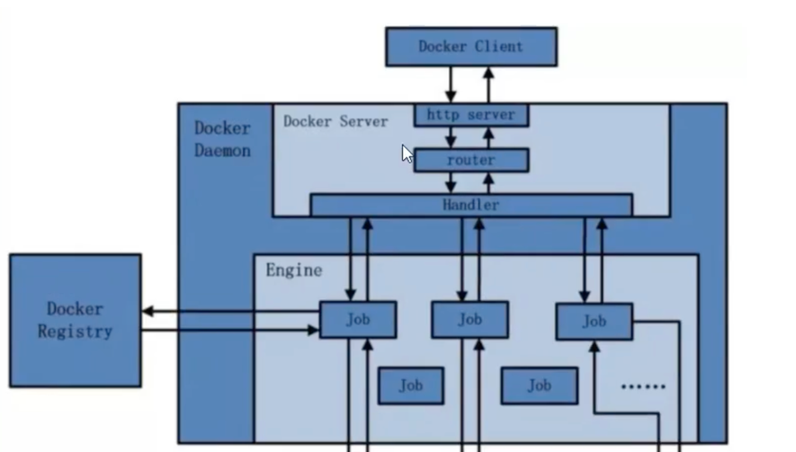
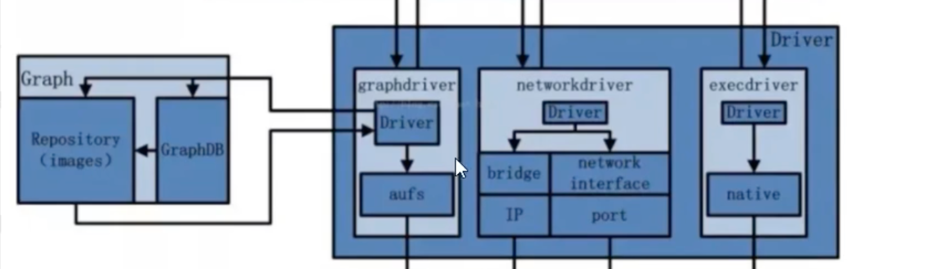
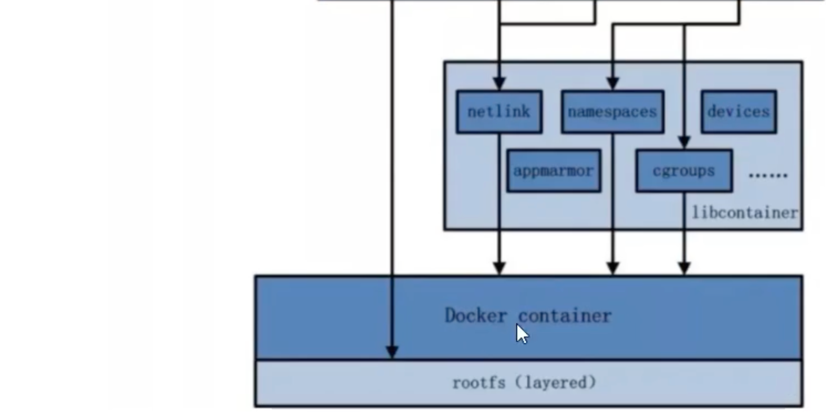


#### Docker和VMare机构比较
vm是在原本的OS上模拟了一层硬件资源，然后再安装对应的操作系统，再运行软件
docker是直接在原来的OS上运行Docker Engine ,然后在其上运行软件
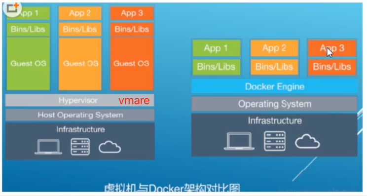

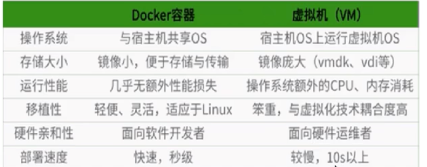

##一 常用命令
systemctl start docker 启动docker服务
docker system df 查看镜像容器占用空间


1. docker run -it ubuntu /bin/bash

> -i interactive 代表以交互模式启动
> -t 代表tty，即伪终端,一般与-i组合使用
> -d 以后台模式运行
> 
2. docker ps [optiona]
> -a 查询所有
> -q 只显示容器ID
> 
3. docker inspect 容器ID                      # 查看容器细节

4. docker ps 容器ID                           # 查看容器内部进程

5. docker exec -it 容器ID /bin/bash           # 重启进入容器(开启新的终端进程) 
   > docker attach 容器ID 也是进入进入容器，但不会开启新的终端。进去后 exit会导致容器终止。所以基本不用

#### 备份常用命令

6. docker cp 容器ID:源路径 目标路径

7. docker export 容器ID > 文件名.tar                      # 以容器为镜像导出tar文件

8. cat 文件名.tar | docker import - 镜像用户/镜像名:镜像版本号  # 从tar文件倒入镜像
> cat abcd.tar | docker import - wjx/ubuntu:3.7

9. docker commit -m "提交的信息" -a "作者" 容器ID 镜像名       # 以现有的容器重新制作镜像
```shell
[root@localhost ~]# docker commit -m "ubuntu vim" -a "wjx" 869279f962e1 duxingge/ubuntu:1.0
sha256:9932f0b2e8463cef776399b589db97a0d8dab884accee1cf05b09538c1aaed98
[root@localhost ~]# docker images
REPOSITORY        TAG       IMAGE ID       CREATED          SIZE
duxingge/ubuntu   1.0       9932f0b2e846   13 seconds ago   160MB
ubuntu            latest    6a47e077731f   2 weeks ago      69.2MB
hello-world       latest    b038788ddb22   4 months ago     9.14kB
```


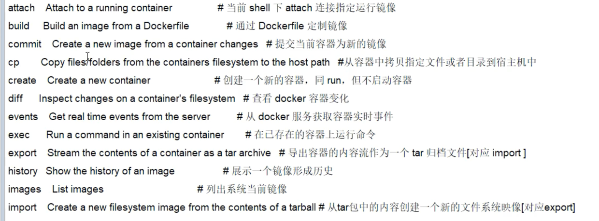
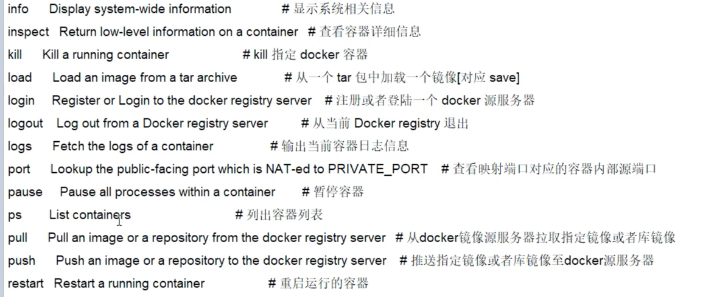
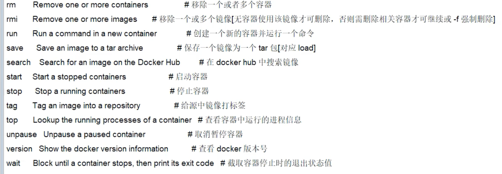

## 二 镜像
镜像的原理是UnionFS(联合文件系统)

UnionFS:分层的,轻量级的,高效的文件系统.他支持对文件系统的一次修改作为一次提交来进行层层叠加，同时可以把不同目录挂载同一个虚拟文件系统中。

#### docker镜像加载原理
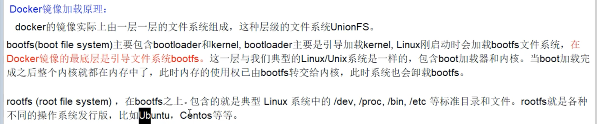
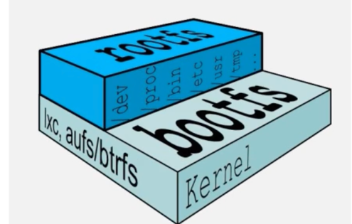

#### 容器层与镜像层
- 当容器启动时，一个新的可写层被加载到镜像的顶部，称为容器层。对容器的修改，删除都是发生在容器层。 
- 容器层之下的都是镜像层，是只读的。
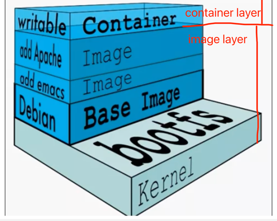

Q1： 对于CentOS，为什么相比虚拟机的几个G，而docker这里才200M?
```text
对于一个精简的OS来说,底层的bootfs可以使用Host的kernel,自己只需要提供rootfs(基本命令，工具和库)就行。
由此可见对于不同的Linux发布版本,rootfs可以不同，但底层的bootfs是相同的,因为他们公用宿主机的bootfs。
```
Q2: 为什么docker要采用分层模式呢?
```text
分层最大的好处就是资源共享，方便迁移和复用
```