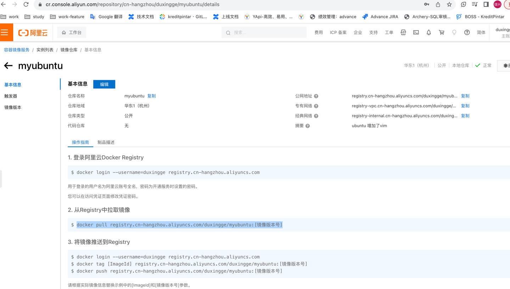

## 一 镜像推送到阿里云
访问阿里云并创建对应的镜像仓库

```shell
[root@localhost ~]# docker login --username=duxingge registry.cn-hangzhou.aliyuncs.com
Password:
WARNING! Your password will be stored unencrypted in /root/.docker/config.json.
Configure a credential helper to remove this warning. See
https://docs.docker.com/engine/reference/commandline/login/#credentials-store

Login Succeeded
# 1. 推送镜像到阿里云
[root@localhost ~]# docker tag 9c40c691dc69 registry.cn-hangzhou.aliyuncs.com/duxingge/myubuntu:1.3

[root@localhost ~]# docker push registry.cn-hangzhou.aliyuncs.com/duxingge/myubuntu:1.3
The push refers to repository [registry.cn-hangzhou.aliyuncs.com/duxingge/myubuntu]
8b6e841b650e: Pushed
61bbeda53374: Pushed
1.3: digest: sha256:2ec74b332c4eb37c61d5c74abcd711508ce4bbdd9c6066dc8935ec83da9e2c6d size: 741
[root@localhost ~]# docker images
REPOSITORY                                            TAG       IMAGE ID       CREATED          SIZE
registry.cn-hangzhou.aliyuncs.com/duxingge/myubuntu   1.3       9c40c691dc69   16 minutes ago   160MB
duxingge/ubuntu                                       1.0       9932f0b2e846   49 minutes ago   160MB
ubuntu                                                latest    6a47e077731f   2 weeks ago      69.2MB

# 2. 从阿里云拉取镜像
[root@localhost ~]# docker pull registry.cn-hangzhou.aliyuncs.com/duxingge/myubuntu:1.3
1.3: Pulling from duxingge/myubuntu
8b5db5f6400d: Already exists
bb06fbba13df: Already exists
Digest: sha256:2ec74b332c4eb37c61d5c74abcd711508ce4bbdd9c6066dc8935ec83da9e2c6d
Status: Downloaded newer image for registry.cn-hangzhou.aliyuncs.com/duxingge/myubuntu:1.3
registry.cn-hangzhou.aliyuncs.com/duxingge/myubuntu:1.3
[root@localhost ~]# docker images
REPOSITORY                                            TAG       IMAGE ID       CREATED          SIZE
registry.cn-hangzhou.aliyuncs.com/duxingge/myubuntu   1.3       9c40c691dc69   20 minutes ago   160MB
ubuntu                                                latest    6a47e077731f   2 weeks ago      69.2MB
hello-world                                           latest    b038788ddb22   4 months ago     9.14kB

```
## 二 镜像推送私有库

1. 下载运行私有库 Docker Registry

```shell
# 1. 下载运行私有库
[root@localhost ~]# docker pull registry
[root@localhost ~]# docker run -d -p 5000:5000 -v /zzyyuse/myregistry/:/tmp/registry --privileged=true registry
c38ef347136b1d7deec1450fe2e8a854182951dae19a965a75d95aea2b5505af
# 2. 检测私有库有什么镜像
[root@localhost ~]# curl -XGET http://192.168.2.221:5000/v2/_catalog
{"repositories":[]}
# 3. 打符合私库规范的tag
[root@localhost ~]# docker tag 9c40c691dc69 192.168.2.221:5000/zzyyubuntu:1.2

# 4. 修改使支持http
[root@localhost ~]# cat /etc/docker/daemon.json
{
  "registry-mirrors": ["https://2cwzc8fd.mirror.aliyuncs.com"],
  "insecure-registries": ["192.168.2.44:5000"]
}
# 5. 推送镜像到仓库
[root@localhost ~]# docker push 192.168.2.221:5000/zzyyubuntu:1.2

# 6. 拉取镜像
[root@localhost ~]# docker pull 192.168.2.221:5000/zzyyubuntu:1.2


```


> 注意1：--privileged=true 扩大容器root用户的权限为超级用户，不加的话root会被当作普通用户对待，导致出现Permission denied
> 注意2：docker run -it xxx /bin/bash进入容器后，exit命令会直接退出容器，想要容器切换到后台执行，请按住Ctrl键，然后依次按P和Q键。


