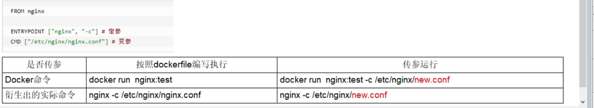

##1.关键字

关键字都是全部大写
```text
FROM: 基础镜像
MAINTAINER: 镜像维护者姓名和邮箱地址
RUN:
    容器构建时需要执行的命令
    两种格式:
        shell格式：RUN + 命令， 如  RUN yum -y install vim
        或者：
        exec格式:  RUN ["可执行文件","参数1","参数2"]  如 RUN ["yum","-y install","vim"]
EXPOSE: 当前容器暴露的端口

WORKDIR: 创建容器后，终端登录进来的默认路径
USER: 该镜像以什么用户执行，默认是root
ENV: 设置全局环境变量
ADD: 将本地的文件copy到容器，如果是tar的话自动解压，如果是URL也自动处理
COPY: 同ADD,但不解压
VOLUMN: 等同于参数-V 容器卷映射和持久化
CMD: 指定容器启动后要干的事， 格式与RUN一样
    如果有多个CMD命令，只有最后一个起作用
    docker run 后面如果有启动参数，会覆盖掉CMD命令
    注意： CMD是docker run时运行，RUN是docker build时运行
ENTRYPOINT: 如果ENTRYPOINT存在, 那么启动命令变为 <ENTRYPOINT>+ <最后一个CMD>
    如果docker run 后面如果有启动参数，会覆盖掉CMD命令,变为 <ENTRYPOINT> + <run后带的参数>
```


# 2. Dockerfile案例演示
目标： 基于CentOS安装vim, ifconfig, 和JDK8

1. 构造Dockerfile
```shell
FROM centos:7
MAINTAINER wjx<q156717494@gmail.com>
ENV MYPATH /usr/local
WORKDIR $MYPATH

#安装vim
RUN yum -y install vim

#安装ifconfig命令
RUN yum -y install net-tools

#安装java8及lib库
RUN yum -y install glibc
RUN mkdir /usr/local/java
# 将本机相对路径下的jdk 复制到/usr/local/java/并解压
ADD jdk-8u202-linux-arm64-vfp-hflt.tar.gz /usr/local/java/
# 配置java环境
ENV JAVA_HOME /usr/local/java/jdk1.8.0_202
ENV JRE_HOME $JAVA_HOME/jre
ENV CLASSPATH $JAVA_HOME/lib/dt.jar:$JAVA_HOME/lib/tools.jar:$JRE_HOME/lib:$CLASSPATH
ENV PATH $JAVA_HOME/bin:$PATH
EXPOSE 8080

CMD echo $MYPATH
CMD echo "----------success-------------ok"
CMD /bin/bash
```

2. 构建镜像

```shell
#以当前目录下的Dockerfile文件构建镜像 centosjdk8:1.5
[root@localhost ~]# docker build -t centosjdk8:1.5 .
# 进入容器
[root@localhost ~]# docker run -it centosjdk8:1.5 /bin/bash
```

```shell
注： 虚悬镜像dangling: 错误删除容器或其他操作导致的无名称和tag的镜像,如下. 见到的时候删除即可

[root@localhost dd]# docker images
REPOSITORY                      TAG       IMAGE ID       CREATED         SIZE
<none>                          <none>    3c409f6ee987   2 years ago     301MB

# 删除所以虚悬镜像
[root@localhost dd]# docker rmi $(docker images -q -f "dangling=true")
```
        
## 3. 构建springboot Dockerfile文件，键hello-word模块