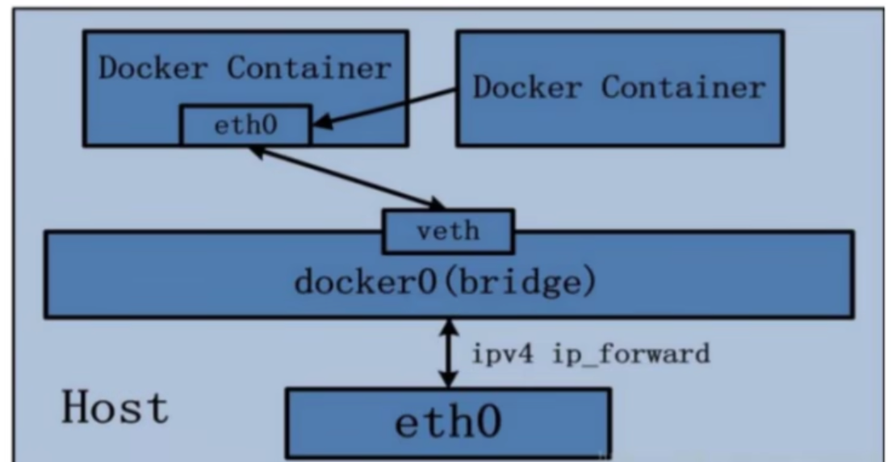

# 一 基础

docker启动后，会多一个docker0的虚拟网桥。容器就是通过这个网桥进行容器和宿主机，容器和容器之间的通讯
 


网络能干什么？
> 容器间的互联和通信以及端口映射
>
> 容器IP变动时可以通过服务名直接网络通信而不受到影响

## 1.1 启动docker - 查看docker网络
```shell
# 查看docker网络列表 
[root@localhost /]#  docker network ls
NETWORK ID     NAME      DRIVER    SCOPE
# bridge比较常用，host用的比较少,none基本不用
f08c6a810114   bridge    bridge    local
0e7c9dfe6681   host      host      local
6914a11b8e93   none      null      local
# 查看指定网络
[root@localhost /]# docker network inspect bridge
# 添加和删除网络
[root@localhost /]# docker network create aa_network
3d38d3296fe993a86bbc8128c7ba058032e7614c46369b25eefd190a6bcabeb6
[root@localhost /]# docker network rm aa_network
aa_network

```
# 1.2 启动镜像

## 1.2.1 网络模式

1. bridge模式: 使用--network bridge指定, 默认使用docker0
2. host模式: 使用--network host指定
3. none模式: 使用--network none指定
4. container模式: 使用--network container:Name或者容器ID指定

## 1.2.2 启动一个镜像
## bridge模式
```shell
[root@localhost /]# docker run -it -d --name c1  centosjdk8:1.5
[root@localhost /]# docker ps
CONTAINER ID   IMAGE            COMMAND                  CREATED       STATUS       PORTS      NAMES
a5600b82057d   centosjdk8:1.5   "/bin/sh -c /bin/bash"   4 hours ago   Up 4 hours   8080/tcp   c1
[root@localhost /]# docker inspect c1
# 1. 新容器默认是bridge模式, 
# 2. 网关就是上面docker0的地址172.17.0.1,容器自己地址为172.17.0.2
# 3. docker容器的IP在重启之后是会变动的
            "Networks": {
                "bridge": {
                    "IPAMConfig": null,
                    "Links": null,
                    "Aliases": null,
                    "NetworkID": "f08c6a810114a2a0553742febcde8e2036b9b5bb5d630413bb4351e73d7fe19c",
                    "EndpointID": "7c2ccbdcbe32ff033e6f459a6191709fdc2715843c11af03b8f59ef7e790493e",
                    "Gateway": "172.17.0.1",
                    "IPAddress": "172.17.0.2",
                    "IPPrefixLen": 16,
                    "IPv6Gateway": "",
                    "GlobalIPv6Address": "",
                    "GlobalIPv6PrefixLen": 0,
                    "MacAddress": "02:42:ac:11:00:02",
                    "DriverOpts": null
                }
            }

```
### Q1 : Docker容器服务是怎么和主机之间通讯的？

A： 内核层docker0 + NAT技术联通容器
1. Docker服务默认会创建一个docker0网桥，docker0网桥在**内核层**连接了其他的物理或虚拟网卡，这就将docker0网卡和本地主机放在了同一个网络，
Docker默认指定了Docker0的ip和子网掩码,从而实现docker0和主机的通信。
    
2. Docker上的其他容器通过docker0(网关)使用**NAT技术**完成容器与主机系统之间的通信。容器之间的网络通信也是以docker0作为通信桥梁。

>当容器启动时，Docker会为每个容器分配一个IP地址(Docker内部IP)，并使用docker0网桥进行通信。Docker还会设置iptables规则，以允许容器访问外部网络并确保容器之间的通信。这是通过NAT规则来实现的，使得容器内部的IP地址可以映射到主机的IP地址，并通过主机的网络连接访问外部资源。
通过NAT，Docker能够有效地隔离容器，同时让它们能够访问主机和外部网络资源。这种网络模型有助于保持容器的安全性和独立性，同时减少了对主机系统的网络配置要求。

### Q2: Docker容器和docker0的架构
docker容器没有指定network的话默认使用的就是bridge模式。
1. 整个宿主机的**网桥模式**都是基于docker0,docker0类似交换机，他有一堆接口，都叫vethxxxx,
   新建的容器也会有一个接口叫eth0,veth和eth0一一对应，叫做veth pair.
2. 每个容器都将自己的接口eth0映射到docker0的一个接口中，并会拿到docker0这个网关(如172.17.0.1)分配的ip,docker0上的两个容器的ip是在同一个网络的(如172.17.0.2和172.17.0.3)，所以是互通的。

**veth pair**: 容器与docker0网络对


##Host模式

直接使用宿主机的IP地址与外界通信，不再需要进行额外的NAT转换。


docker使用host网络时，使用-P命令指定映射端口是无效的，端口以主机端口为主。
```shell
# docker run -d -it --network host --name t2 tomcat
[root@localhost /]# docker run -d -it --network host -p 8082:8080 --name t2 tomcat
WARNING: Published ports are discarded when using host network mode
31cb4b29e8085f66547980d0ce5df47571b1b1ebb2d293f7cae45abde643d834
[root@localhost /]# docker ps
CONTAINER ID   IMAGE     COMMAND             CREATED          STATUS          PORTS                                       NAMES
# 可以看到t2没有端口映射
31cb4b29e808   tomcat    "catalina.sh run"   8 seconds ago    Up 8 seconds                                                t2
9dada661ac3a   tomcat    "catalina.sh run"   36 seconds ago   Up 36 seconds   0.0.0.0:8081->8080/tcp, :::8081->8080/tcp   t1
```
##None模式
该模式下容器只有lo回环网络，没有其他网络配置
```shell
[root@localhost ~]# docker run -d --network none -it myjdk:1.6 /bin/bash
476d568ae4ff40f3318251b2d4ac721f5e4e5bb733693a6b47acd628ec680c64
[root@localhost ~]# docker exec -it 476d568ae4ff /bin/bash
[root@476d568ae4ff local]# ip addr
1: lo: <LOOPBACK,UP,LOWER_UP> mtu 65536 qdisc noqueue state UNKNOWN group default qlen 1000
    link/loopback 00:00:00:00:00:00 brd 00:00:00:00:00:00
    inet 127.0.0.1/8 scope host lo
       valid_lft forever preferred_lft forever
```

##Container模式
1. 新建的容器不会创建自己的网卡和配置自己的IP,而是和一个指定的容器共享IP和端口范围等。但两个容器除了网络之外都是隔离的。



```shell
[root@localhost ~]# docker exec -it jdk1 /bin/bash
[root@6f2f2c30cb98 local]# ip addr
1: lo: <LOOPBACK,UP,LOWER_UP> mtu 65536 qdisc noqueue state UNKNOWN group default qlen 1000
    link/loopback 00:00:00:00:00:00 brd 00:00:00:00:00:00
    inet 127.0.0.1/8 scope host lo
       valid_lft forever preferred_lft forever
147: eth0@if148: <BROADCAST,MULTICAST,UP,LOWER_UP> mtu 1500 qdisc noqueue state UP group default
    link/ether 02:42:ac:11:00:04 brd ff:ff:ff:ff:ff:ff link-netnsid 0
    inet 172.17.0.4/16 brd 172.17.255.255 scope global eth0
       valid_lft forever preferred_lft forever
[root@6f2f2c30cb98 local]# exit
exit
[root@localhost ~]# docker run -it --name jdk2 --network container:jdk1 --name jdk2 myjdk:1.6
[root@6f2f2c30cb98 local]# ip addr
1: lo: <LOOPBACK,UP,LOWER_UP> mtu 65536 qdisc noqueue state UNKNOWN group default qlen 1000
    link/loopback 00:00:00:00:00:00 brd 00:00:00:00:00:00
    inet 127.0.0.1/8 scope host lo
       valid_lft forever preferred_lft forever
147: eth0@if148: <BROADCAST,MULTICAST,UP,LOWER_UP> mtu 1500 qdisc noqueue state UP group default
    link/ether 02:42:ac:11:00:04 brd ff:ff:ff:ff:ff:ff link-netnsid 0
    inet 172.17.0.4/16 brd 172.17.255.255 scope global eth0
       valid_lft forever preferred_lft forever
```

2. 如果A共享B的网络，B容器关闭后，A共享的网络也回消失

3. bridge模式下,ip可以通过docker0连接互通，但name无法做到映射

4. 自定义网络模式下,ip可以通过docker0连接互通，name也自动与IP映射 


