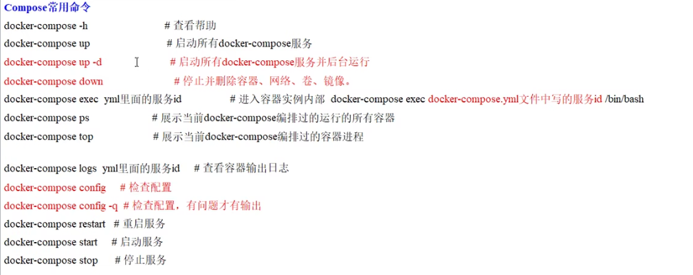

# 概念
docker-compose：用于定义和运行多个 Docker 容器的应用程序，通常使用 YAML 文件来配置容器之间的关系和属性。docker-compose 使得在多个容器之间构建、启动和管理应用程序变得更加简单，特别是在开发和测试环境中。

## 一 compose常用命令


## 例子,打造 应用,mysql,redis一键运行


```shell
#1.编写docker-compose.yml
version: '3'


# 定义网络, wjx_net不存在时创建
networks:
  wjx_net:


services:
  myfoodie:
    image: myfoodie:latest
    networks:
      - wjx_net
    ports:
      - "8080:8080"
    volumes:
      - /root/myfoodie/data:/data
    depends_on:
      - mysql
      - redis
# docker run -d -p 3306:3306 --privileged=true -v /zzyyuse/mysql/log:/var/log/mysql -v /zzyyuse/mysql/data:/var/lib/mysql -v /zzyyuse/mysql/conf:/etc/mysql/conf.d -e MYSQL_ROOT_PASSWORD=123456 --name mysql mysql:8.0      
  mysql:
    image: mysql:8.0
    networks:
      - wjx_net
    ports:
      - "3306:3306"
    volumes:
      - /root/myfoodie/mysqldata/log:/var/log/mysql
      - /root/myfoodie/mysqldata/data:/var/lib/mysql
      - /root/myfoodie/mysqldata/conf:/etc/mysql/conf.d
    environment:
      MYSQL_ROOT_PASSWORD: 123456
      # 注意因为有-v容器卷映射/var/lib/mysql，所以该语句不生效的
      MYSQL_DATABASE: foodie-shop-dev
      MYSQL_USER: 'zzyy'
      MYSQL_PASSWORD: 'zzyy123'
# docker run -d -p 6379:6379 --name myredis --privileged=true -v /app/redis/redis.conf:/etc/redis/redis.conf -v /app/redis/data:/data redis:6.0.8 redis-server /etc/redis/redis.conf
  redis:
    image: redis:6.0.8
    networks:
      - wjx_net
    ports:
      - "6379:6379"
    volumes:
      - /app/redis/redis.conf:/etc/redis/redis.conf
      - /app/redis/data:/data
    command: redis-server /etc/redis/redis.conf


```