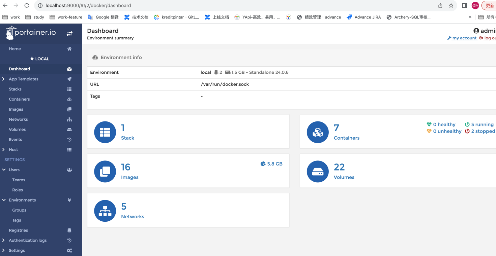
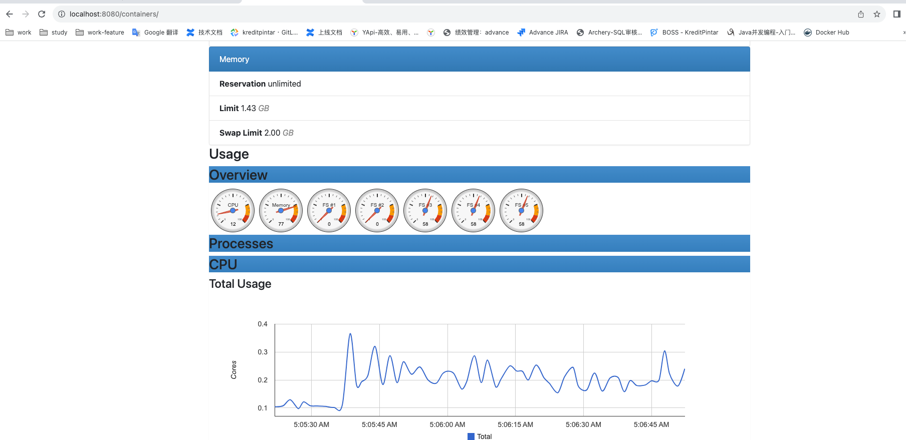

#Docker可视化工具

## 1.轻量级可视化工具Portainer
一款轻量级可视化工具。提供了可视化界面，主要单机环境下用来管理Docker环境，集群环境更多使用K8s.

> docker run -d -p 8000:8000 -p 9000:9000 --name portainer --restart=always -v /var/run/docker.sock:/var/run/docker.sock -v portainer_data:/data portainer/portainer-ce:latest

访问 http://localhost:9000/
设置密码(admin123)


## 2.Docker容器监控三剑客CIG

docker status统计的只是当前宿主机的全部容器的实时状态，没有地方存储和预警设置。所以使用CIG来优化。
(CAdvisor监控收集+InfluxDb数据存储+Granfana展示图表)。

> 使用compose一键启动CIG

```shell

# docker CIG监控
version: '3'

services:

  influxdb:
    image: influxdb:latest
    container_name: influxdb
    restart: always
    ports:
      - "8086:8086"
      - "8083:8083"
    environment:
      - PRE_CREATE_DB=cadvisor

  cadvisor:
    image: linuxkit/cadvisor:6ae4b50f8279692c459bccd0003066d22bd558ce-arm64
    links:
      - influxdb:influxsrv
    command: --storage_driver=influxdb --storage_driver_host=influxsrv:8086 --storage_driver_db=cadvisor
    container_name: cadvisor
    restart: always
    ports:
      - "8080:8080"
    volumes:
      - /:/rootfs:ro
      - /var/run:/var/run:rw
      - /sys:/sys:ro
      - /var/lib/docker/:/var/lib/docker:ro

  grafana:
    user: "0:0"
    image: grafana/grafana:latest
    container_name: grafana
    restart: always
    ports:
      - "3000:3000"
    depends_on:
      - influxdb
    links:
      - influxdb:influxsrv
    environment:
      - GF_SECURITY_ADMIN_PASSWORD=admin
      - GF_USERS_ALLOW_SIGN_UP=false
      - INFLUXDB_HOST=influxsrv
      - INFLUXDB_PORT=8086
      - INFLUXDB_NAME=cadvisor
      - INFLUXDB_USER=root
      - INFLUXDB_PASS=root
    volumes:
      - /grafana/data:/var/lib/grafana
```
cadvisor:

