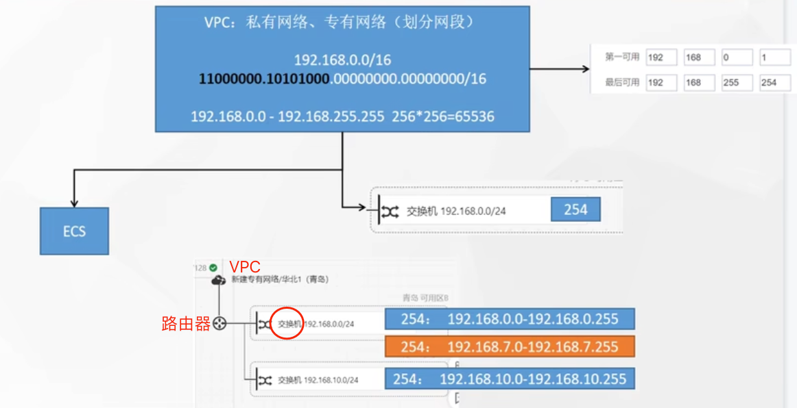
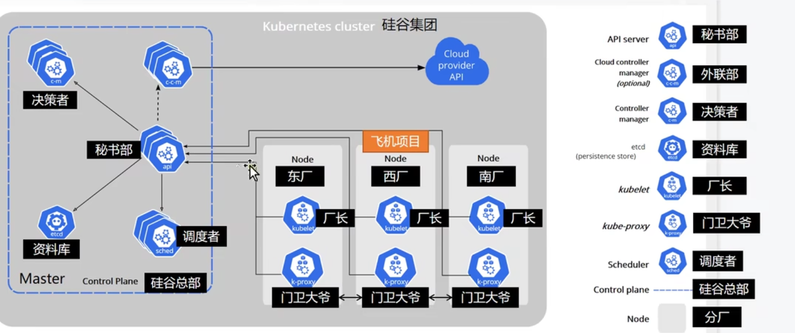

##专业名词
1. ECS(Elastic Compute Service): 弹性云服务器
2. VPC: 私有网络，专有网络，同一个ESC下的各个局域网(交换机建立的局域网)互通(通过路由器互通)


## 1. K8s架构



## 2.安装K8s

#### 1、基本环境
```shell
#设置每个机器自己的hostname
hostnamectl set-hostname xxx

# 将 SELinux 设置为 permissive 模式（相当于将其禁用）
sudo setenforce 0
sudo sed -i 's/^SELINUX=enforcing$/SELINUX=permissive/' /etc/selinux/config

#关闭swap
swapoff -a  
sed -ri 's/.*swap.*/#&/' /etc/fstab

#允许 iptables 检查桥接流量
cat <<EOF | sudo tee /etc/modules-load.d/k8s.conf
br_netfilter
EOF

cat <<EOF | sudo tee /etc/sysctl.d/k8s.conf
net.bridge.bridge-nf-call-ip6tables = 1
net.bridge.bridge-nf-call-iptables = 1
EOF
sudo sysctl --system
```
#### 2.安装kubelet、kubeadm、kubectl

```shell
## 配置k8s yum数据源
cat <<EOF | sudo tee /etc/yum.repos.d/kubernetes.repo
[kubernetes]
name=Kubernetes
baseurl=http://mirrors.aliyun.com/kubernetes/yum/repos/kubernetes-el7-aarch64
enabled=1
gpgcheck=0
repo_gpgcheck=0
gpgkey=http://mirrors.aliyun.com/kubernetes/yum/doc/yum-key.gpg
   http://mirrors.aliyun.com/kubernetes/yum/doc/rpm-package-key.gpg
EOF

#安装 kubelet，kubeadm，kubectl
sudo yum install -y kubelet-1.20.9 kubeadm-1.20.9 kubectl-1.20.9

#启动kubelet
sudo systemctl enable --now kubelet

#所有机器配置master域名
echo "192.168.31.222  k8s-master" >> /etc/hosts
```
#### 3.初始化master节点

```shell
kubeadm init \
--apiserver-advertise-address=192.168.31.222 \
--control-plane-endpoint=k8s-master \
--image-repository registry.aliyuncs.com/google_containers \
--kubernetes-version v1.28.2 \
--service-cidr=10.96.0.0/16 \
--pod-network-cidr=172.21.0.0/16

## 注意看报错，有时候journalctl -xeu kubelet，找不到镜像时(failed to get sandbox image \"registry.k8s.io/pause:3.6\": failed to pull image)
##执行,(master+多个node节点都执行)
ctr -n k8s.io image pull registry.cn-hangzhou.aliyuncs.com/google_containers/pause:3.6
ctr -n k8s.io image tag registry.cn-hangzhou.aliyuncs.com/google_containers/pause:3.6 k8s.gcr.io/pause:3.6
ctr -n k8s.io image tag registry.cn-hangzhou.aliyuncs.com/google_containers/pause:3.6 registry.k8s.io/pause:3.6
## 初始化成功后，出现：
Your Kubernetes control-plane has initialized successfully!

To start using your cluster, you need to run the following as a regular user:

  mkdir -p $HOME/.kube
  sudo cp -i /etc/kubernetes/admin.conf $HOME/.kube/config
  sudo chown $(id -u):$(id -g) $HOME/.kube/config

Alternatively, if you are the root user, you can run:

  export KUBECONFIG=/etc/kubernetes/admin.conf

You should now deploy a pod network to the cluster.
Run "kubectl apply -f [podnetwork].yaml" with one of the options listed at:
  https://kubernetes.io/docs/concepts/cluster-administration/addons/

You can now join any number of control-plane nodes by copying certificate authorities
and service account keys on each node and then running the following as root:

  kubeadm join k8s-master:6443 --token eypbyc.wvn5ew5ugy7rvmiy \
	--discovery-token-ca-cert-hash sha256:ec6c734ecb8d83ceef72d5a18125ae18f42504dcea155c1d4fb553a278e36865 \
	--control-plane

Then you can join any number of worker nodes by running the following on each as root:
# 一般24小时失效
kubeadm join k8s-master:6443 --token eypbyc.wvn5ew5ugy7rvmiy \
	--discovery-token-ca-cert-hash sha256:ec6c734ecb8d83ceef72d5a18125ae18f42504dcea155c1d4fb553a278e36865

## 执行提示
  mkdir -p $HOME/.kube
  sudo cp -i /etc/kubernetes/admin.conf $HOME/.kube/config
  sudo chown $(id -u):$(id -g) $HOME/.kube/config
## 如果失效，那么需要重新生成加入的token
[root@k8s-master ~]# km token create --print-join-command
kubeadm join k8s-master:6443 --token k27kfd.ayf7q9a1m681oxmz --discovery-token-ca-cert-hash sha256:ec6c734ecb8d83ceef72d5a18125ae18f42504dcea155c1d4fb553a278e36865
```

## 4.安装calico网络插件

```shell
curl https://docs.projectcalico.org/manifests/calico.yaml -O

# 注意，如果修改了master节点初始化的IP段，那么修改calico网络段与master配置的节点段一致
[root@k8s-master ~]# cat calico.yaml | grep 192.168
            #   value: "192.168.0.0/16"
# 改 #   value: "192.168.0.0/16"， 去掉注释,改为   value: "172.21.0.0/16"
            - name: CALICO_IPV4POOL_CIDR
              value: "172.21.0.0/16"

# 创建网络插件calico
kubectl apply -f calico.yaml
```

## 至此，master节点准备就绪
```shell
[root@k8s-master ~]# kubectl get nodes
NAME         STATUS   ROLES           AGE   VERSION
k8s-master   Ready    control-plane   33m   v1.28.2
[root@k8s-master ~]# kubectl get pod -A
NAMESPACE     NAME                                       READY   STATUS    RESTARTS   AGE
kube-system   calico-kube-controllers-7ddc4f45bc-dh8zw   1/1     Running   0          9m24s
kube-system   calico-node-wtzcd                          1/1     Running   0          4m9s
kube-system   coredns-66f779496c-m42bv                   1/1     Running   0          35m
kube-system   coredns-66f779496c-nbf79                   1/1     Running   0          35m
kube-system   etcd-k8s-master                            1/1     Running   1          36m
kube-system   kube-apiserver-k8s-master                  1/1     Running   1          36m
kube-system   kube-controller-manager-k8s-master         1/1     Running   1          36m
kube-system   kube-proxy-6gz2q                           1/1     Running   0          35m
kube-system   kube-scheduler-k8s-master                  1/1     Running   1          36m
``


