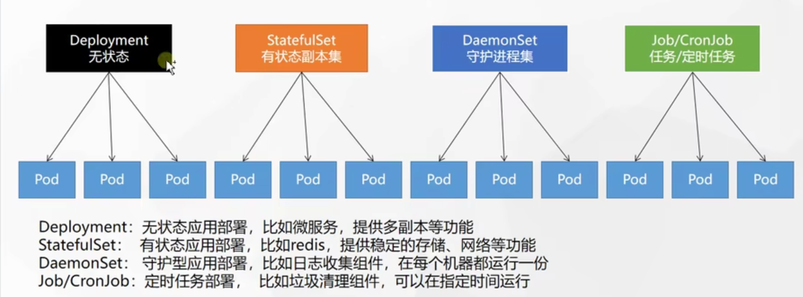
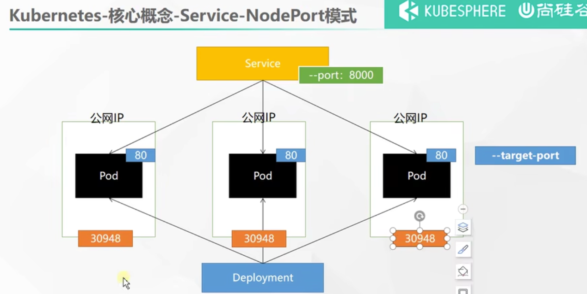
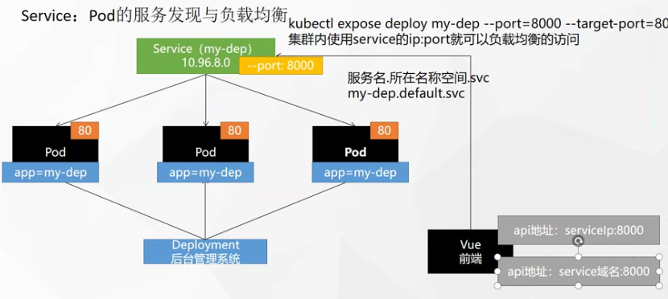
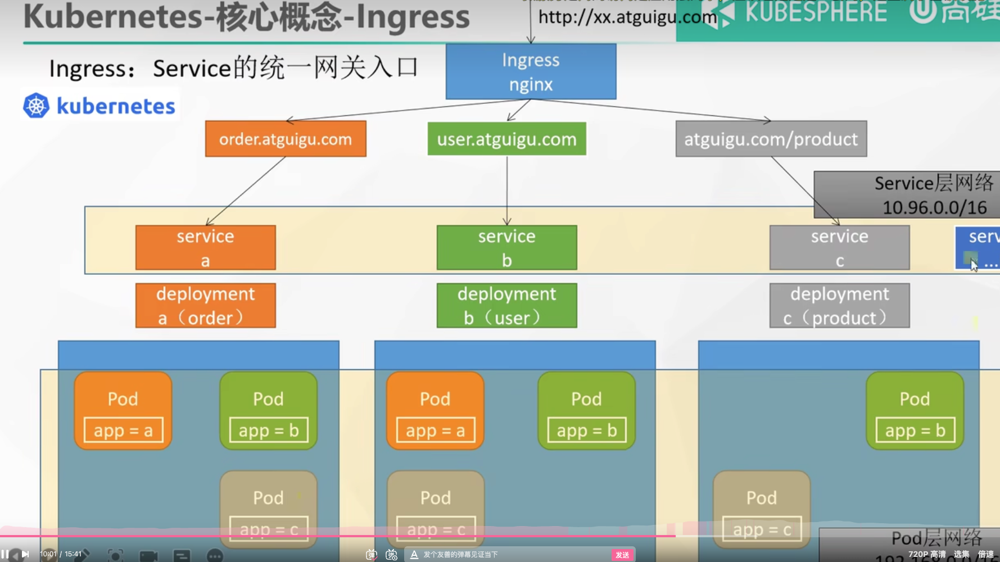

k8s集群：
    master节点： 192.168.31.222
    slave1节点： 192.168.31.223
    slave2节点： 192.168.31.224
    Pod网络范围: --pod-network-cidr=172.21.0.0/16
    Service网络范围： --service-cidr=10.96.0.0/16
    

#一.概念

##1. namespace
只隔离资源，不隔离网络

##2. Pod
运行中的一组容器，是K8s中应用的最小单位。
1. pod的IP对应K8s集群初始化指定的--pod-network-cidr=172.21.0.0/16

###工作负载:都是通过Pod实现的

1. Deployment:无状态应用部署，如微服务，提供多副本功能
2. StatefulSet:有状态应用部署,比如redis，提供稳定的存储,网络功能
3. DaemonSet:守护进程应用部署，如日志收集组件，每台机器都运行一份
4. Job/CronJob:定时任务部署,比如垃圾清理组件，可以在指定的时间运行


##3. Deployment: 控制副本，使Pod拥有多副本,自愈,扩缩容,滚动更新等能力

```shell
# 1.多副本
kubectl create deployment my-dep --image=nginx --replicas=3
[root@k8s-master ~]# kl get pod -o wide
NAME                     READY   STATUS    RESTARTS   AGE   IP               NODE        NOMINATED NODE   READINESS GATES
my-dep-7674c564c-h8p4x   1/1     Running   0          51s   172.21.169.131   k8s-node2   <none>           <none>
my-dep-7674c564c-n7xds   1/1     Running   0          51s   172.21.36.69     k8s-node1   <none>           <none>
my-dep-7674c564c-szhqc   1/1     Running   0          51s   172.21.169.132   k8s-node2   <none>           <none>
#2. 扩缩容
##也可以修改yml文件  kubectl edit deploy my-dep
kubectl scale --replicas=5 deployment/my-dep
[root@k8s-master ~]# kl get deploy
NAME     READY   UP-TO-DATE   AVAILABLE   AGE
my-dep   5/5     5            5           6m6s
#3. 滚动更新: 一个pod接着一个更新
# --record 记录本次更新
[root@k8s-master ~]# kl set image deployment/my-dep nginx=nginx:1.16.1 --record
my-dep-567c96d8cd-96vlz   1/1     Running             0          24s
my-dep-567c96d8cd-j6lzx   1/1     Running             0          24s
my-dep-567c96d8cd-mh4p4   0/1     ContainerCreating   0          3s
my-dep-567c96d8cd-q9wl2   1/1     Running             0          24s
my-dep-567c96d8cd-sswq5   1/1     Running             0          5s
my-dep-7674c564c-6ndd2    0/1     Terminating         0          26m
# 查看滚动更新状态
[root@k8s-master ~]# kl rollout status deployment/my-dep
Waiting for deployment "my-dep" rollout to finish: 3 out of 5 new replicas have been updated...
Waiting for deployment "my-dep" rollout to finish: 3 out of 5 new replicas have been updated...

#4. 版本回退
##4.1 查看部署的历史记录
[root@k8s-master ~]# kl rollout history deployment/my-dep
deployment.apps/my-dep
REVISION  CHANGE-CAUSE
1         <none>
2         kubectl set image deployment/my-dep nginx=nginx:1.16.1 --record=true
##4.2 查看某个历史详情
[root@k8s-master ~]# kl rollout history deployment/my-dep --revision=1
deployment.apps/my-dep with revision #1
Pod Template:
  Labels:	app=my-dep
	pod-template-hash=7674c564c
  Containers:
   nginx:
    Image:	nginx
    Port:	<none>
    Host Port:	<none>
    Environment:	<none>
    Mounts:	<none>
  Volumes:	<none>
## 4.3 回滚(回到上次)
[root@k8s-master ~]# kl rollout undo deployment/my-dep
deployment.apps/my-dep rolled back
## 4.4回滚到指定版本
[root@k8s-master ~]# kl rollout undo deployment/my-dep --to-revision=1
deployment.apps/my-dep rolled back
[root@k8s-master ~]# kl get deployment -oyaml | grep image
        - image: nginx
          imagePullPolicy: Always

```


##4. Service: Pod的负载均衡和服务发现
4.1. 服务发现-service的ip在k8s集群初始化时指定--service-cidr=10.96.0.0/16

4.2 type: ClusterIp和NodePort
> ClusterIp: 集群IP 暴露的端口只能在集群内访问

> NodePort: 可以在集群外访问, 会在每一个节点上创建端口, 可以通过公网IP+端口(k8s默认创建30000-32767之间的一个端口，比如下图的30948)访问

kl expose deploy my-dep --port=8000 --target-port=80 --type=NodePort



4.2.1 ClusterIp 集群IP 暴露的端口只能在集群内访问

```shell
#1. 创建service
#kl expose deploy my-dep --port=8000 --target-port=80 --type=ClusterIP 默认type=ClusterIP
[root@k8s-master ~]# kl expose deploy my-dep --port=8000 --target-port=80
service/my-dep exposed
## 等同于下列的yaml
#apiVersion: v1
#kind: Service
#metadata:
#  labels:
#    app: my-dep
#  name: my-dep
#spec:
#  ports:
#  - port: 8000
#    protocol: TCP
#    targetPort: 80
#  selector:
#    app: my-dep
#  type: ClusterIP
[root@k8s-master ~]# kl get service
NAME         TYPE        CLUSTER-IP      EXTERNAL-IP   PORT(S)    AGE
kubernetes   ClusterIP   10.96.0.1       <none>        443/TCP    2d20h
my-dep       ClusterIP   10.96.170.216   <none>        8000/TCP   6s

#2. 进入容器中，使用serviceName:port(只能在容器中访问)/serviceIp:port(可以在容器外访问)访问-负载均衡
[root@k8s-master ~]# kl get pod
NAME                     READY   STATUS    RESTARTS   AGE
my-dep-7674c564c-8s9gm   1/1     Running   0          29m
my-dep-7674c564c-cjmh8   1/1     Running   0          28m
my-dep-7674c564c-q7hwb   1/1     Running   0          29m
[root@k8s-master ~]# kl exec -it my-dep-7674c564c-8s9gm -- /bin/bash
root@my-dep-7674c564c-8s9gm:/# curl my-dep:8000
11
root@my-dep-7674c564c-8s9gm:/# curl my-dep:8000
333
root@my-dep-7674c564c-8s9gm:/# curl 10.96.170.216:8000
11
root@my-dep-7674c564c-8s9gm:/# curl 10.96.170.216:8000
333
```

4.2.2 NodePort 节点上创建端口, 可以通过节点的公网IP+端口(k8s默认创建30000-32767之间的一个端口，比如下图的30948)访问

```shell
#1. 创建NodePort端口(指定了--port 8000 --target-port 80，ClusterIP式访问也支持)
[root@k8s-master ~]# kl expose deployment my-dep --port 8000 --target-port 80 --type=NodePort
service/my-dep exposed
[root@k8s-master ~]# kl get svc
NAME         TYPE        CLUSTER-IP     EXTERNAL-IP   PORT(S)          AGE
kubernetes   ClusterIP   10.96.0.1      <none>        443/TCP          2d20h
my-dep       NodePort    10.96.214.76   <none>        8000:32521/TCP   74s
## 可以看出，开放了集群**所有节点**的32521端口
#2. 通过集群节点ip:port(任意主/从节点)访问
wangjiaxing@MacBook-Pro ~ % curl 192.168.31.223:32521
222
wangjiaxing@MacBook-Pro ~ % curl 192.168.31.222:32521
333

```

## 5. Ingress: Service的外部访问的统一网关入口
ingress底层是Nginx,因此也支持nginx的一些高级功能,比如路径转发和限流

5.1 为什么要有Ingress?
>A：service解决了容器内通过服务名的服务调用,但是外部流量目前只能通过节点IP来访问(type=NodePort下)。外部流量要通过域名访问，那么就要引入ingress


5.2 安装ingress-controller

```shell
wget https://raw.githubusercontent.com/kubernetes/ingress-nginx/controller-v0.47.0/deploy/static/provider/baremetal/deploy.yaml

#1.1 修改镜像
vi deploy.yaml
#1.2 将image的值改为如下值：
registry.cn-hangzhou.aliyuncs.com/duxingge/ingress-nginx-controller:1.9.4

#2. 安装镜像
[root@k8s-master ingress-controller]# kl apply -f deploy.yaml

#3. 检查安装的结果
[root@k8s-master ingress-controller]# kl get pod,svc -n ingress-nginx
NAME                                            READY   STATUS             RESTARTS   AGE
pod/ingress-nginx-admission-create-mzc89        0/1     Completed          0          28h
pod/ingress-nginx-admission-patch-d997h         0/1     ImagePullBackOff   0          28h
pod/ingress-nginx-controller-67d8f45948-j8nwg   1/1     Running            0          28h

NAME                                         TYPE        CLUSTER-IP      EXTERNAL-IP   PORT(S)                      AGE
service/ingress-nginx-controller             NodePort    10.96.254.193   <none>        80:30531/TCP,443:32728/TCP   28h
service/ingress-nginx-controller-admission   ClusterIP   10.96.25.60     <none>        443/TCP
#可以看到ingress-controller以NodePort的方式暴露了32531和32728的端口
#4. 通过任意一个节点IP访问网关ingress-controller http://192.168.31.223:32503/
[root@k8s-master ingress-controller]# curl 192.168.31.224:32531
<html>
<head><title>404 Not Found</title></head>
<body>
<center><h1>404 Not Found</h1></center>
<hr><center>nginx</center>
</body>
</html>
```

5.3 配置ingress

演示例子，通过ingress分别分发域名hello.atguigu.com和demo.atguigu.com到服务hello-server和nginx-demo中

5.3.1 定义服务hello-server和nginx-demo文件test.yaml
```yaml
apiVersion: apps/v1
kind: Deployment
metadata:
  name: hello-server
spec:
  replicas: 2
  selector:
    matchLabels:
      app: hello-server
  template:
    metadata:
      labels:
        app: hello-server
    spec:
      containers:
      - name: hello-server
        image: registry.cn-hangzhou.aliyuncs.com/lfy_k8s_images/hello-server
        ports:
        - containerPort: 9000
---
apiVersion: apps/v1
kind: Deployment
metadata:
  labels:
    app: nginx-demo
  name: nginx-demo
spec:
  replicas: 2
  selector:
    matchLabels:
      app: nginx-demo
  template:
    metadata:
      labels:
        app: nginx-demo
    spec:
      containers:
      - image: nginx
        name: nginx
---
apiVersion: v1
kind: Service
metadata:
  labels:
    app: nginx-demo
  name: nginx-demo
spec:
  selector:
    app: nginx-demo
  ports:
  - port: 8000
    protocol: TCP
    targetPort: 80
---
apiVersion: v1
kind: Service
metadata:
  labels:
    app: hello-server
  name: hello-server
spec:
  selector:
    app: hello-server
  ports:
  - port: 8000
    protocol: TCP
    targetPort: 9000
```
> [root@k8s-master example]# kl apply -f test.yaml

#5.3.2 配置域名转发 myingress.yaml

```yaml
apiVersion: networking.k8s.io/v1
kind: Ingress  
metadata:
  name: ingress-host-bar
spec:
  ingressClassName: nginx
  rules:
  - host: "hello.atguigu.com"
    http:
      paths:
      - pathType: Prefix
        path: "/"
        backend:
          service:
            name: hello-server
            port:
              number: 8000
  - host: "demo.atguigu.com"
    http:
      paths:
      - pathType: Prefix
        path: "/nginx"  # 把请求会转给下面的服务，下面的服务一定要能处理这个路径，不能处理就是404
        backend:
          service:
            name: nginx-demo  ## java，比如使用路径重写，去掉前缀nginx
            port:
              number: 8000
```
> [root@k8s-master example]# kl apply -f myingress.yaml

```yaml
[root@k8s-master ingress-controller]# curl hello.atguigu.com:30531
helloWorld
```

#2.知识

1. k8s启动yml文件资源
> kubectl apply -f xxx.yaml

2. 删除yaml定义的资源
> kl delete -f xxx.yaml


