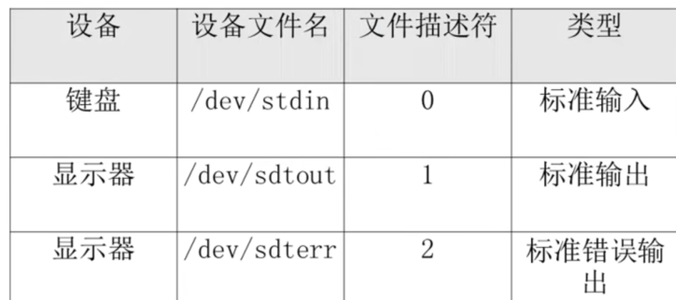
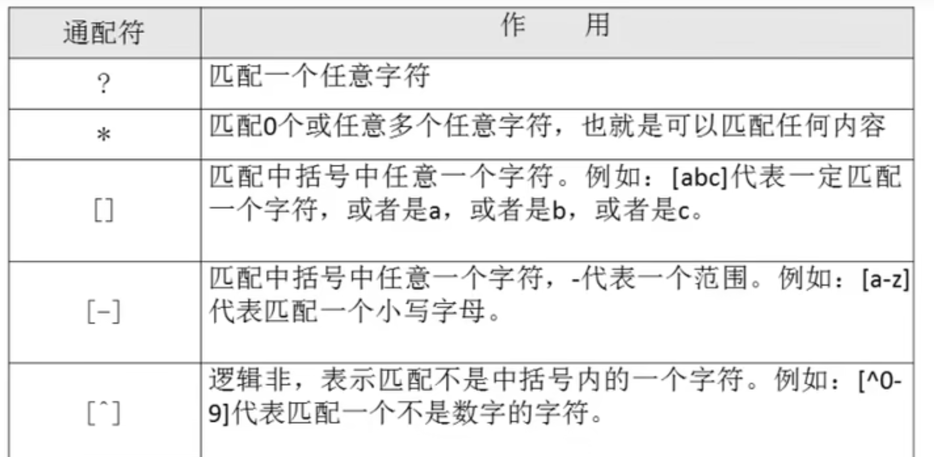
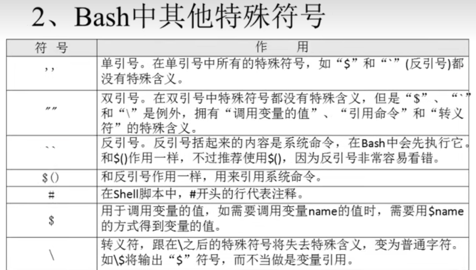
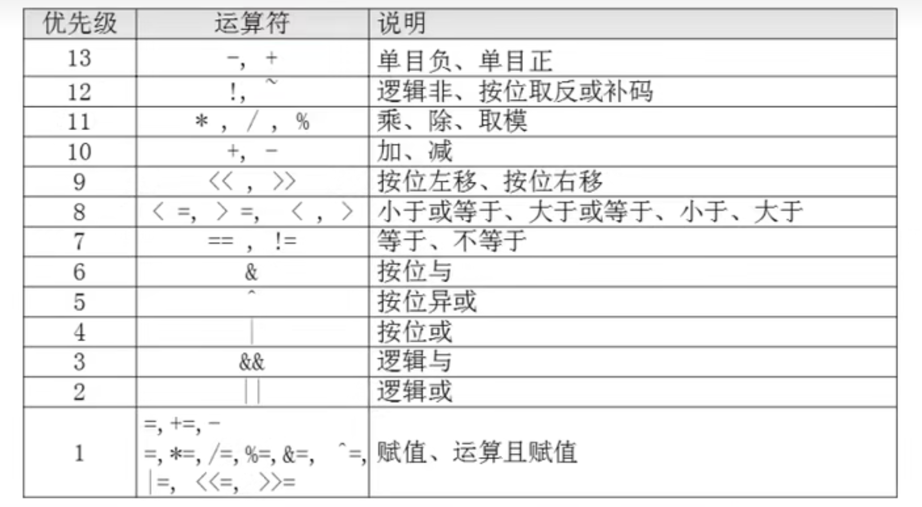
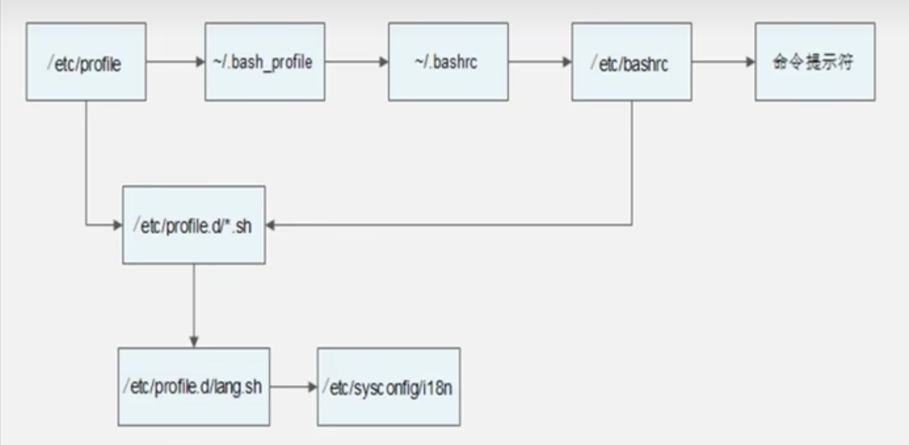
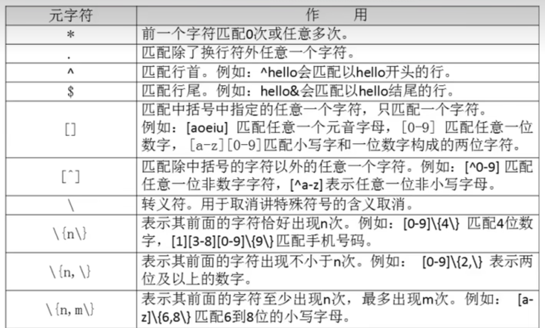

# Shell

## 一. 基础

### 1. 什么是shell

shell是一个命令解释器，
将用户的命令解释为机器语言发送给内核，然后将内核的机器语言返回翻译为自然语言返回给用户。
shell 也是一个强大的编程语言，在shell中可以直接调用linux系统命令
### 2. shell分类

shell主要的语法类型有两种：

    Bourne家族: sh ksh Bash psh zsh
    C家族:      csh tcsh

### 3 语法

1.echo

    -e  支持符号转义
    例子: echo "hello word"
    例子: echo -e "hello\tword"
2.history
    
    -c: 清空历史命令 
    -w: 把缓存中的历史命令写入文件~/.bash_history
   
3.alias 别名='原命令'
    
    命令执行时检测顺序：
        1.使用绝对路径/相对路径执行的命令
        2.执行别名
        3.执行Bash内置命令
        4.按照$PATH环境变量定义的路径顺序查找到的第一个
    让别名永久生效：写入/root/.bashrc或者写入~/.bashrc中

4. 标准输入输出
    
    
    4.1 输出重定向
        
        命令 > 文件    以覆盖的方式，将正确的输出输出到指定的文件和设备中。
        命令 >> 文件   以覆盖的方式，将正确的输出输出到指定的文件和设备中。
   
        命令 2> 文件   以覆盖的方式，将错误的输出输出到指定的文件和设备中。
        命令 2>> 文件  以追加的方式，将错误的输出输出到指定的文件和设备中。
        
        命令 &> 文件   已覆盖的方式，将正确和错误的输出同时保存到文件。
        命令 &>> 文件   已追加的方式，将正确和错误的输出同时保存到文件。
        命令 >> 文件1 2>> 文件2 以追加的方式，分别将正确的输出保存到文件1，错误的输出保存到文件2
5. 多命令顺序执行
   
        命令1 ; 命令2       多个命令顺行执行, 命令之间没有任何的逻辑联系
        命令1 && 命令2      逻辑与，命令1执行成功后，命令2才会执行
        命令1 || 命令2      逻辑或，命令1执行不正确，命令2才会执行

6. 管道符
        
        命令1 ｜ 命令2   命令1的正确输出作为命令2的操作对象

7.通配符
? * [] '' "" `` $() \ #



## 二 变量

1. Bash中， 变量的默认类型是字符串型
2. 变量用等号连接值，等号左右不能有空格
3. 变量允许叠加，但需要使用"$var"xx或者${var}xx

### 变量分类

#### 1.用户自定义变量
```shell
# 变量赋值
name=sc
name2="$name"k1
name3=${name}k1
dd=${date}
# 变量查看
set # 查看所有变量

# 变量删除
unset name

```

#### 2. 环境变量(大写)
1. 用户自定义变量只对当前shell生效，而环境变量会对当前shell和子shell生效，
   如果写入配置文件，那么环境变量会对所有shell生效。
   
2. 用法
```shell
#设置环境变量
export 变量名=变量值

#查询环境变量
env

#删除变量
unset 变量名
```

注： pstree 可以查看进程详情以及进程嵌套关系

3. 常见环境变量
   PATH： 当前环境变量
   PS1： 当前提示符

#### 3.位置参数变量
```shell
 $0 命令本身 
 $n 第n个参数, 10及以上用${n}
 $* 命令行所有参数,所有参数当成一个整体
 $@ 命令行所有参数, 所有参数当初一个数组
 $# 参数的数目
```

#### 4.预定义变量
```shell
$? 上一个命令的执行结果. 0表示上一命令执行正确. 非0表示上一命令执行失败
$$ 当前进程ID
$! 后台运行的最后一个进程ID
```
接收键盘输入: 
   
      read [选项] [变量名]
         -t 秒数 等待用户的输入时间
         -p 提示信息
         -n 最大输入字符数
         -s 隐藏输入，用于敏感字段输入
```shell

read -t 30 -p "please input your name: " name
echo $name

read -t 30 -n 1 -p "please input your sex[M/F]: " sex
echo $sex
```
 
## 三 运算

### 数值运算与运算符

#### declare命令 了解即可

       declare [+-][选项] 变量名
         -： 给变量设置类型属性
         +： 取消变量类型属性
         -i: 将变量设置成整数类型
         -x: 将变量指定为环境变量
         -p: 显示变量类型

```shell
wangjiaxing@MacBook-Pro ~ % aa=111
wangjiaxing@MacBook-Pro ~ % bb=222
wangjiaxing@MacBook-Pro ~ % echo $aa+$bb
111+222
wangjiaxing@MacBook-Pro ~ % declare -i cc=$aa+$bb
wangjiaxing@MacBook-Pro ~ % echo $cc
333
```

#### $((运算式))     常用

```shell
wangjiaxing@MacBook-Pro ~ % aa=111
wangjiaxing@MacBook-Pro ~ % bb=222
wangjiaxing@MacBook-Pro ~ % echo $(($aa+$bb))
333
wangjiaxing@MacBook-Pro ~ % echo $(( (11+22)/3 ))
11
```
> 注意 $(命令)是执行系统命令 与 $(运算) 执行运算的区别

#### 常见运算符



## 四 环境变量配置文件

#### source
根据配置文件重新刷新

```shell
source 配置文件
#或者
. 配置文件
```

#### 常见的配置文件
下面的文件覆盖上面的文件: 
      /etc/profile
      /etc/profile.d/*.sh
      ~/.bash_profile
      ~/.bashrc
      /etc/bashrc

#### 配置文件执行流程



#### ~/.bash_logout 注销时生效的环境变量配置文件

#### ~/bash_history 历史操作记录文件

#### /etc/issue 本地终端欢迎信息

#### /etc/issue.net 远程终端欢迎信息 # 需要在/etc/ssh/sshd_config中加入 Banner /etc/issue.net才能生效


# 四 正则表达式

#### 正则 VS 通配符
1. 正则是匹配文件中符合条件的字符串，为包含匹配， 如 grep , sed, awk
2. 匹配符是匹配符合条件的文件名，如ls,cp,find 他们不支持正则


-----------
1.正则表达式格式


2. cut命令 
   
提取目标第几列，一般与grep配合
   
        cut [选项] 文件名
            -f 列号
            -d 分隔符 默认为制表符
        例子: cut -d ":" -f 5 /etc/passwd
        cut对于非固定数量空格间隔的支持不好，此时需要cut


3. printf命令 - Linux和awk都支持

        printf '输出类型格式' 输出内容
            %ns     输出字符串, n代表输出几个字符串
            %ni     输出整数, n代表输出几个整数
            %m.nf   输出浮点数, 代表整数部位m位，小数部位n位

```shell
# 例子1： 输入的参数大于%s指定的个数时，会循环匹配输出格式
[root@localhost ~]# printf %s 1 2 3 4 5 6
123456
[root@localhost ~]# printf '%s %s' 1 2 3 4 5 6
1 23 45 6
[root@localhost ~]# printf '%s %s\n' 1 2 3 4 5 6
1 2
3 4
5 6
# 例子2： 打印文件内容(注意因为f1.sh内容大于%s的个数1，所以会循环匹配%s导致没有空格输出)
[wjx@localhost shell]$ cat f1.sh
#!/bin/bash

echo sss
echo "command" $0
echo "param1 $1"
echo "all param " $@
[wjx@localhost shell]$ printf '%s' $(cat f1.sh)
#!/bin/bashechosssecho"command"$0echo"param1$1"echo"allparam"$@
```
> print 会换行，但Linux不支持

4. awk命令

5. sed 命令

6. 字符处理命令

    1. sort
            
            sort [选项] 文件名
                -n 以数值型进行排序, 默认以字符串排序
                -r 反向排序
                -t 指定分隔符，默认为制表键
                -k n[,m] 按指定第n到m个字段排序
    
```shell
#以字符排序
sort /etc/passw
#以第3列到第3列按数字排序
sort -t ':' -n -k 3,3 /etc/passwd
```
    
    2. wc
        
            wc [选项] 文件名
                -l 行
                -w 单词
                -c 字节数

## 五 条件判断

test表达式有两种格式
```shell
# 判断/etc/passwd是否存在
test -e /etc/passwd
#或者
[ -e /etc/passwd ]  # 更常用,注意[]前后必须有空格
```

> [ -e /etc/passwd ] && echo yes || echo no

#### 1. 文件类型判断
```shell
# 判断/etc/passwd是否存在
[ -e /etc/passwd]
# 判断/etc/passwd是否存在 && 是否文件
[ -f /etc/passwd] 
# 判断/etc/passwd是否存在 && 是否目录
[ -d /etc/passwd] 
```
#### 2. 文件权限判断

```shell
# 判断文件存在 && 是否具有读权限（注意，判断的是所有的UGO权限，而不是当前用户是否具有）
[ -r /etc/passwd ] 
# 判断文件存在 && 是否具有写权限
[ -w /etc/passwd ]
# 判断文件存在 && 是否具有执行权限
[ -x /etc/passwd ] 
```

#### 文件比较

```shell
# 判断/etc/passwd修改时间是否比/etc/shadow文件新
[ /etc/passwd -nt /etc/shadow ]

# 判断/etc/passwd修改时间是否比/etc/shadow文件旧
[ /etc/passwd -ot /etc/shadow ]

# 判断/etc/passwd与/etc/shadow的INode节点是否一致(即判断是否硬链接)
[ /etc/passwd -eq /etc/shadow ]
```
#### 整数比较
```shell
## 整数aa与bb是否相等
[ $aa -eq $bb ]
# -lt -gt -ne -ge -le
```

#### 字符串比较

```shell
# 字符串是否为空 (空返回真)
[ -z $aa ]
# 字符串是否非空 (非空返回真) 
[ -n $aa ] 
# 字符串是否相等  ==
[ "aa" == "$bb" ]
# 字符串是否不相等  !=
[ "aa" != "$bb" ]
```

#### 多重条件判断

```shell
# 逻辑与 -a
[ "aa" == "bb" -a 3 -gt 1 ] && echo yes || echo no
# 逻辑或 -o
[ "aa" == "bb" -o 3 -gt 1 ] && echo yes || echo no
# 逻辑非 ! ,注意!之后必须有空格
[ ! 3 -gt 1 ] && echo yes || echo no

```
#### if语句

if [ 条件判断 ] 
    then
        xxxx
    elif [ 条件判断 ]
        xxxx
    else
        xxxx
fi


#### case 语句

case $变量 in 
    "值1")
        xxxx
        ;;
    "值2")
        xxxx
        ;;
    *)
        xxxx
esac

```shell
case $cho in
	"1")
		echo "here is shanghai"
		;;
	"2")
		echo "here is beijing"
		;;
	"3")
		echo "here is xian"
		;;
	*)
		echo "error input!. only 1/2/3"
esac
```

#### for语句

1. 语法1

```shell
for 变量1 in 值1,值2,值3
  do
     xxxx
  done
```

2. 语法2

```shell
for (( 初始值;循环条件;变量变化 ))
  do
      xxxxx
  done
```

#### while语句

```shell
while   [ 条件判断 ]
    do
      xxxx
    done
```

#### until语句

符合条件判断时终止

```shell
until   [ 条件判断 ]
    do
      xxxx
    done
```
