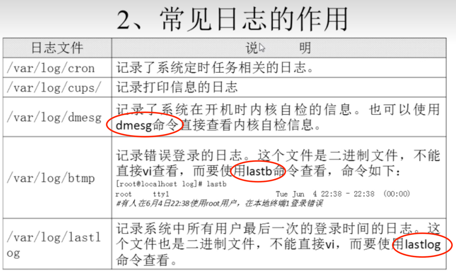
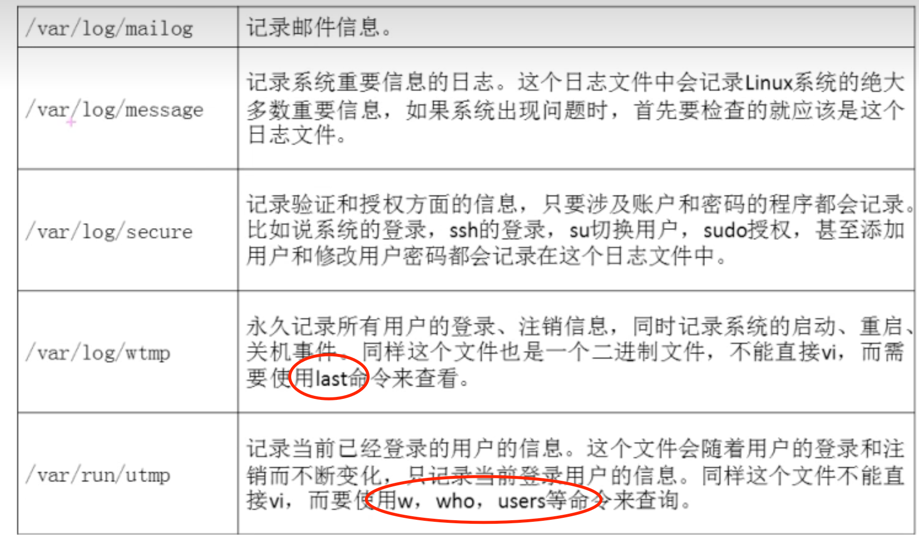
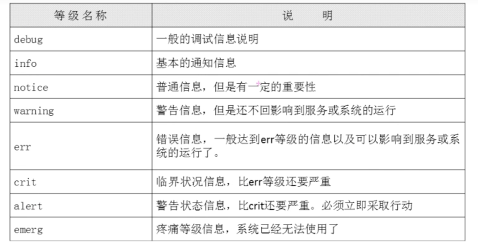
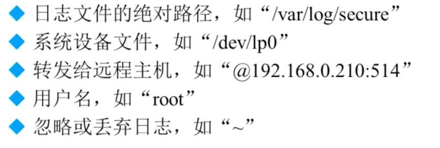
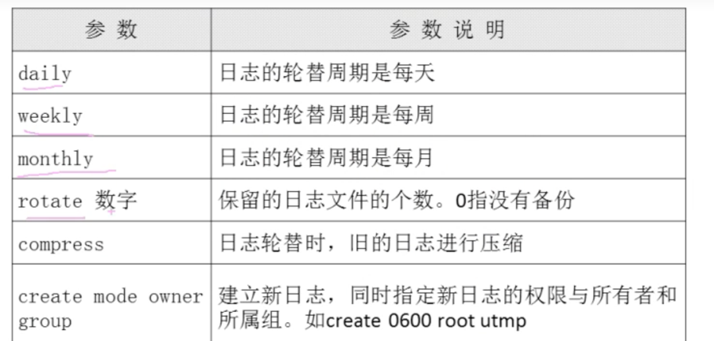
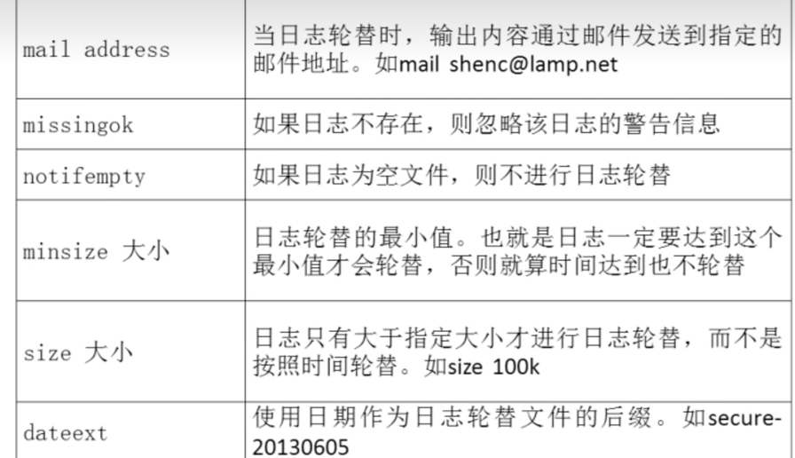

# 日志


## 一 基础服务 rsyslogd

```shell
#默认启动
[root@localhost etc]# ps aux | grep rsyslogd
root      1162  0.0  0.6 164672  9260 ?        Ssl  06:32   0:01 /usr/sbin/rsyslogd -n
```

#### 1. 常见的日志
+ last
+ lastlog
+ w
+ cat /var/log/message


#### 2. 日志文件格式
时间 主机 服务名 时间具体信息

#### 3. 日志配置文件

```shell
[root@localhost etc]# cat /etc/rsyslog.conf
# 服务authpriv的所有级别日志记录在 /var/log/secure 里面
authpriv.*                                              /var/log/secure
```
##### 3.1 连接符号
1) .        记录比.后级别高的日志
2) .=       记录等于.=后级别的日志    
3) .!       记录不等于.!后级别的日志 如 authpriv.!info

##### 3.2 日志级别


#### 3.3 记录位置


注： 发送给用户时，用户必须在线，否则就丢了


## 二 日志轮替组件 logrotate
logrotate可以将目标日志进行轮替切分


        logrotate
            -f 强制执行


1. 配置文件 /etc/logrotate.conf
   
```shell
# 参考配置 对文件/usr/local/apache2/logs/access_log每天切分,保持30次的备份
/usr/local/apache2/logs/access_log {
  daily
  create
  rotate 30
}
```
2. 配置参数


