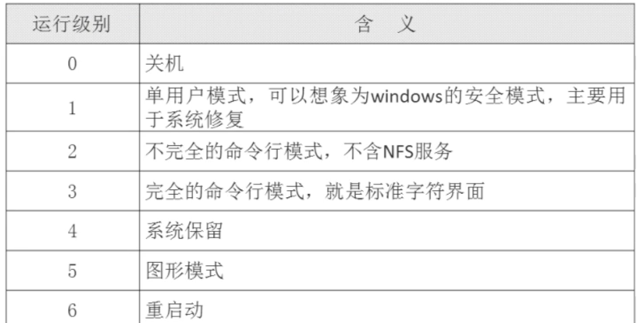
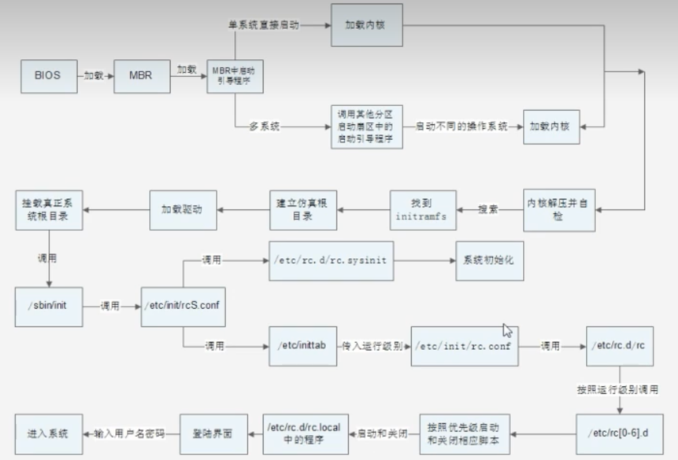

# 启动管理

## 一 运行级别
重要的几个级别
> 0 关机 3 字符界面 5 图形模式 6 重启动



#### 1. 查看运行级别 runlevel
```shell
# 目前是3级别，他是从5级别切换过来的
[root@localhost logrotate.d]# runlevel
5 3
```
#### 2. 改变运行级别 init xx

```shell
[root@localhost logrotate.d]# init 3
```

## Linux启动流程 了解即可



#### /etc/rc.d/rc[0-6].d文件
    不同的运行级别[0-6]启动不同的运行程序
        /etc/rc3.d/k?? 开头的(?是数字)会按数字顺序依次关闭服务
        /etc/rc3.d/s?? 开头的(?是数字)会按数字顺序依次开启服务


