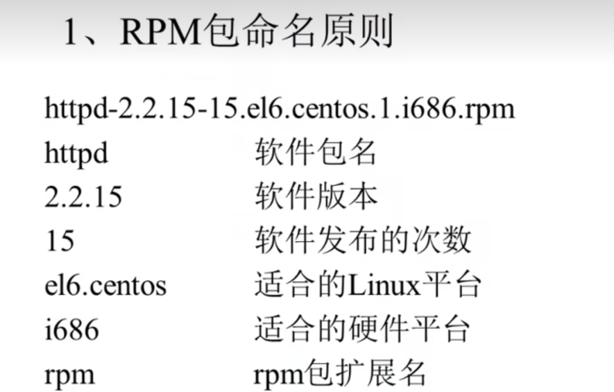
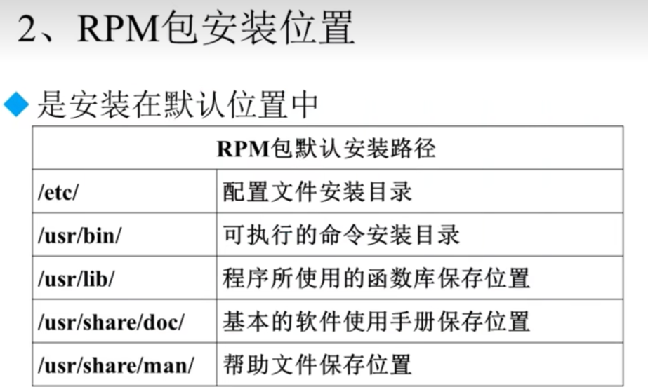

# Linux软件包

####分类
    1. 源码包： 
        1. 缺点：
            1. 安装慢(编译慢)，
            2. 安装步骤多，容易出错
        2. 优点: 
            1. 开源(可以看到源代码),能力足够，可以根据自己的需求更改。
            2. 开源安装的软件一般效率更高(5%左右)
    2. 二进制包(RPM包)： 已经编译好的二进制包,但不能看到源代码了
            1.缺点:
                1. 不能看到源代码
                2. 依赖性
            2.优点:
                1. 包管理简单，只需要几个命令就可以实现包的安装从，查询，升级和卸载
                2. 安装速度比源码包快
#### 命名规则


包全名: httpd-2.2.15-15.el6.centos.1.i686.rpm
包名: httpd   （包名其实是搜索 /var/lib/rpm下的数据库）

#### 依赖
1. 树形依赖: a->b->c
2. 循环依赖: a->b->c->a 需要一起装

注: 依赖查询网站: www.rpmfind.net
注： xxxx.so.xxxx是某个包中的某一个模块，可以在www.rpmfind.net里面查具体的包
```shell
[root@home152 Packages]# rpm -ivh mysql-connector-odbc-5.2.5-8.el7.x86_64.rpm
错误：依赖检测失败：
libodbcinst.so.2()(64bit) 被 mysql-connector-odbc-5.2.5-8.el7.x86_64 需要
```
## 一 RPM

#### rpm安装
rpm -ivh 包全名

    -i install 安装
    -v verbose 显示详细信息
    -h hash 显示安装进度
#### rpm升级
rpm -Uvh 包名
#### rpm卸载
rpm -e 包名
    需要从依赖性逐个卸载

### rpm查询 （常用）

#### 查询是否安装
rpm -q 包名 
    
#### 查询所有安装
rpm -qa

#### 查询包信息
rpm -qi 包名

    -p 查询未安装的软件包 注意包名->包全名

#### 查询包安装位置
rpm -ql

    -l 位置
    -p 查询未安装的软件包将要装的默认位置 注意包名->包全名

#### 查看文件所属安装包
rpm -qf 系统文件名

#### 查询未安装包的所有依赖包
rpm -qpR 全包名

### RPM包校验

#### 校验安装的包修改情况
rpm -V 包名

    注： 5 代表内容被修改
    c 配置文件  
    d 普通文件(documentation)
    l 授权文件(license file) 
    r 描述文件

#### RPM包中提取文件
注意： 一般用于文件误删后恢复
rpmcpio
```shell
# 首先查误删的包在哪个rpm包里面
rpm -qf /bin/ls
# 将rpm转成cpio, 然后提取其中的ls文件到./bin/ls
rpm2cpio /mnt/cdroom/Packages/coreutils-xxx.i686.rpm | cpio -idv ./bin/ls
# 将ls文件复制到原位置
cp ./bin/ls /bin/

```
#### 从指定文件/设备中提取文件
cpio 选项  [文件/设备]  

    -i copy-in模式 还原  
    -d 还原时显示目录  
    -v 显示还原过程


## 二  yum- 在线管理RPM
    
    注意： yum管理的也是rpm包，没有yum包这一说

### yum源地址配置(默认已配置好，但是是国外的源一般较慢)
/etc/yum.repos.d/CentOS-Base.repo

    /etc/yum.repos.d 下.repo都是源，默认Base生效。离线下可以使CentOS-Media.repo(光盘)生效

#### yum查询源下的所有包
    yum list

#### yum包安装
yum -y intsall 包名

    -y 自动yes

#### ~~包升级~~ 
yum -y update 包名     谨慎使用，记得加包名
    

    注意 不加包名会使所有包升级！甚至包含内核！！很危险！！！

#### ~~包删除~~ 
yum -y remove 包名     尽量不要用
    
    注意 依赖该包的其他包也会下载!!

#### 查看软件包组

yum grouplist

### 光盘yum源搭建

    1. 修改baseurl为光盘的挂载位置;注释掉不用的地址
    baseurl=file:///mnt/cdrom
    2. 设置enabled=1

## 三 源码包管理

### 安装位置
#### rpm包安装位置

#### 源码包安装位置

    /usr/local/软件名/->

#### 安装位置不同带来的影响
1. rpm包安装的服务可以使用系统服务(service会在/etc/rc.d/init.d/下寻找)命令来管理，但是源码安装的不行，因为安装位置不同。例如apache的启动方法：  
   

    service httpd start
    等同于
    /etc/rc.d/init.d/httpd start

    注意： /etc/rc.d/init.d/ 为所有rpm包安装的服务所在
    注意： service 为redHat独有命令

2. 源码包安装的服务只能使用绝对路径来管理

### 源码包安装
源码包保存位置: /usr/local/src/
包安装位置: /usr/local/


    1. 安装gcc
    2. 下载源码包
    3. 解压缩源码包
    4. 进入解压缩目录
    5. ./configure 软件配置和检测（查看INSTALL文件）
        如 ./configure --prefix=/usr/local/apache
    6. make （编译）
        make clean (make 错误时可以使用此命令清空所有的错误编译文件)
    7. make install （编译安装）

    注意： 源码包里面一般都有 INSTALL 安装说明文件 和 README 使用说明文件

### 源码包卸载
直接rm源码包安装目录

## 四 人工写的脚本安装

    1. 下载源码
    2. 解压并执行setup.sh


   


