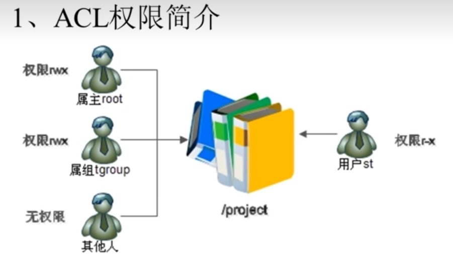
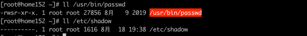

#1. ACL权限
## 一. 简介
###1.作用
    主要解决UGO(user+group+other)权限不够用的情况
举例：目录project的权限如下图，现在想要新加一个rx权限的试听用户，原来的UGO权限就不够用了。

###2. 查看分区是否支持ACL权限（大多数分区默认支持ACL）
    dumpe2fs -h /dev/sda3
    dumpe2fs是查看指定分区详细文件系统信息的命令
    -h 进显示超级块中的信息
###2.1 临时开启ACL
mount -o remount,acl /

###2.2 永久开启分区acl
1. 配置文件 /etc/fstab. 将defaults改为defaults,acl
2. 重新挂载，使修改生效 mount -o remount /

## 二，ACL权限操作
###1. 查看ACL权限
####1.查看ACL权限
getfacle 文件名
    
####2. 设定ACL权限命令

    setfacl [选项] 文件名
        -m 设定ACL权限
        -x 删除指定的用户/组的ACL权限
        -b 删除文件所有的ACL权限
        -d 设定默认的ACL权限
        -k 删除默认的ACL权限
        -R 递归设定ACL权限
    
例子1： 设置用户st的acl权限为rx
```shell
[root@home152 ~]# setfacl -m u:st:rx /project/
[root@home152 ~]# ll -d /project/
drwxrwx---+ 2 wjx wjx 6 8月  18 19:38 /project/
[root@home152 ~]# getfacl /project/
getfacl: Removing leading '/' from absolute path names
# file: project/
# owner: wjx
# group: wjx
user::rwx
user:st:r-x
group::rwx
mask::rwx
other::---
```
例子2： 设置组testgroup权限

```shell
[root@home152 ~]# setfacl -m g:testgroup:rx /project
[root@home152 ~]# getfacl /project/
getfacl: Removing leading '/' from absolute path names
# file: project/
# owner: wjx
# group: wjx
user::rwx
user:st:r-x
group::rwx
group:testgroup:r-x
mask::rwx
other::---
```

例子3 删除用户/组的ACL权限

```shell
#删除用户st的ACL权限
setfacl -x u:st /project/
#删除组testgroup的ACL权限
setfacl -x g:testgroup /project/
#删除文件上的acl权限(但不包括UGO权限)
setfacl -b /project/
```

例子4： 递归设定ACL权限(设定目录及所有子目录的ACL权限) (只对目录有用)

注意1：目录下新建的文件/目录不会有该ACL权限

注意2：-R 必须写下文件夹前面

```shell
setfacl -m u:st:rx -R /project/
```

例子5 设定文件夹下用户/组默认的ACL权限 (只对目录有用)

```shell
setfacl -m d:u:st:rwx /project/
```


#### 最大有效权限
上面的mask::rwx 就是最大的有效权限。用户的真正ACL权限是mask权限与设置的ACL相与.

setfacl -m m:rx /project/

例子： group::rwx 为设置的acl权限  #effective:r-x 为实际的acl权限(mask权限与设置的ACL相与)
```shell
[root@home152 ~]# setfacl -m m:rx /project/
[root@home152 ~]# getfacl /project/
getfacl: Removing leading '/' from absolute path names
# file: project/
# owner: wjx
# group: wjx
user::rwx
user:st:r-x
group::rwx			#effective:r-x
group:testgroup:r-x
mask::r-x
other::---
```

#2. 文件特殊权限

###2.1 SetUID   让可执行用户对文件具有执行时具有属主权限  ---危险的指令

    只有可执行文件，才可以设置SetUID权限
    命令的执行者必须要有x权限
    命令的执行着在执行的过程中，获取该文件的属主身份
    SetUID只在程序的执行过程中有效

例子： passwd 命令就有SetUID权限，因此普通用户才可以修改密码(修改了/etc/shadow文件)
注意1 用户的x权限变成了s。 并且这是一个危险的指令，因为以红色标志。
注意2 如果x权限变大写S，那么意味着这是一个错误的SetUID权限(可能是因为组/其他人没有执行权限)


#### 设置SetUID ---危险的操作
4代表SUID
```shell
#设置SetUID权限
chmod 4755 文件名
##或者
chmod u+s 文件名

# 删除SetUID权限 (直接用没有的UGO权限覆盖即可)
chmod 755 文件名
#或者
chmod u-s 文件名

```

###2.2 SetGID

1. 对文件的SetGID权限:  让可执行用户对文件具有执行时具有属组权限
2. 对目录的SetGID权限： 让对目录有xw权限的用户以属组身份创建目录内子文件

#### 设置SetGID

2代表SetGID

```shell
#设置SetGID
chmod 2773 文件名
##或者
chmod g+s 文件名

#删除SetGID
chmod 773 文件名
##或者 
chmod g-s 文件名

```

### 2.3 Sticky Bit 粘着位

作用于目录： 让有wx目录权限的普通用户对无法删除目录下他人文件

```shell
#设置粘着位
chmod 1755 目录名
## 或者
chmod o+t 目录名

#删除粘着位
chmod 755 目录名
##或者
chmod o-t 目录名
```


#3. 文件系统属性chattr权限 -- 重要

主要目的是锁定文件/目录，防止用户(包括root)误操作

#### 格式： 
    chattr [+-=] [选项] 文件/目录名
        +   增加权限
        -   减少权限
        =   等于某权限

    i权限： 锁定权限
        文件：文件不能修改，重命名，删除或者添加数据
        目录: 目录不能增加删除文件，但能修改目录下文件的数据
    a权限: 追加权限
        文件: 文件不能修改，重命名，不能vim数据，但可以使用>> 追加数据
        目录: 目录下不能删除，重命名文件，但能新增文件
    举例：
        chattr +i f1.txt
#### 查看 chattr权限
    
    lsattr [选项] 文件/目录
        -a 显示所有文件/目录
        -d 若目标是目录，近显示目录本身属性，而不是子文件

#4. 系统命令sudo权限
    
root用户将本来只能超级用户执行的命令授权给普通用户执行

sudo的操作一般是系统命令

#### 设置sudo权限

```shell
# 本质上是修改/etc/sudoers文件
visudo
```
例子：使用户/组可以执行重启命令

    格式：
        # 用户名 本管理主机地址/ALL=(可使用身份) 授权命令(绝对路径)
        例子: sc    ALL=/sbin/shotdown -r now
        # %组 本管理主机地址/ALL=(可使用身份) 授权命令(绝对路径)
        # %wheel    ALL=/sbin/shotdown -r now
    注1: 身份不写，默认root身份
    注2: 授权的命令尽量写详细，比如如果只写shutdown, 那么可能导致执行远程服务器关机
```shell
# 查看当前用户的sudo命令
sodu -l

# 执行sudo命令
#例子
sudo shotdown -r now
```


--------------------

附注1: SetUID权限很危险，因此应该对系统中默认有SetUID的文件做一列表，定期扫描有没有其他文件被设置了SetUID权限。
