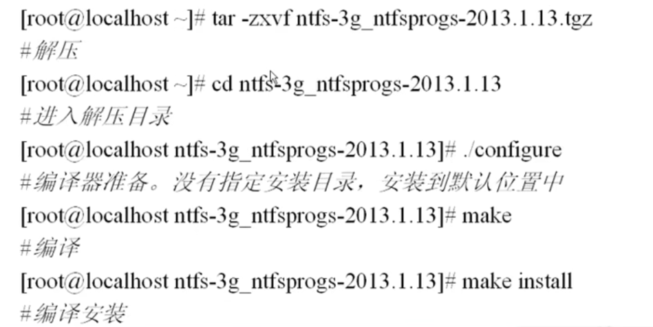
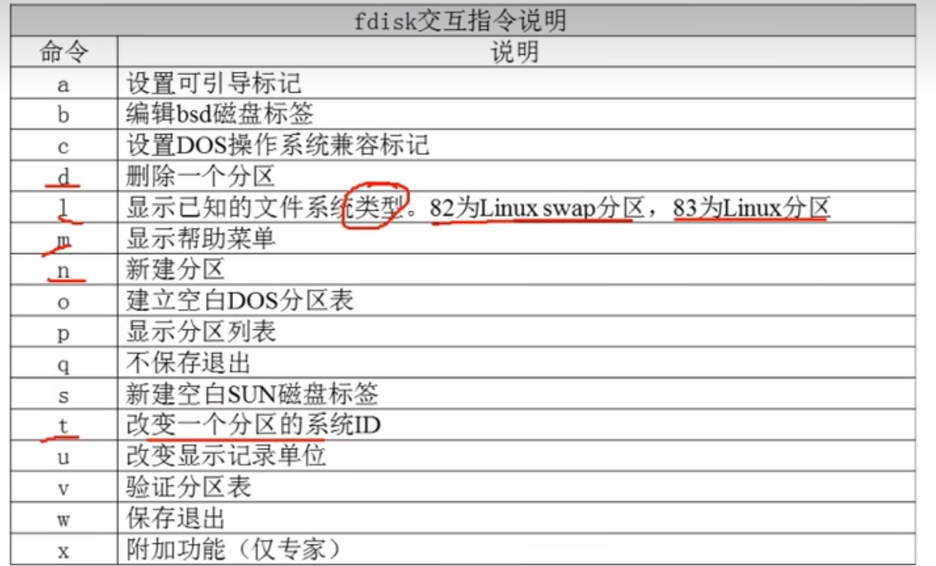
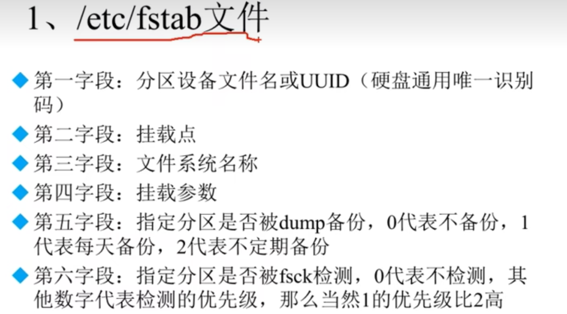

#文件系统管理

```shell
# 查看分区大小
df -h

# 查看目录磁盘占用
du -sh /project/

# 将设备/dev/sr0挂载到/mnt/cdrom
mount /dev/sr0 /mnt/cdrom

# 查看挂载
mount

# 将/etc/fstab配置重新挂载
mount -a

# 卸载挂载/dev/sr0
umount /dev/sr0  

# 查看分区
fdisk -l


##新加一块磁盘，使用fdisk 进行磁盘分区，1个主分区2G，一个逻辑分区8G， 并完成挂载##
#1. 开启磁盘/dev/sdb的分区程序 fdisk /dev/sdb  
#...
#2. 重新读取分区信息  partprobe 
#3. 格式化分区       mkfs -t ext4 /dev/sdb1
#4. 挂载分区         mount /dev/sdb1 /disk1


```


----------
## 一 文件系统常用命令

### 1. 查看分区大小 df

    格式 df [选项] [挂载点]
        -h 使用习惯单位显示容量

例子： df 

### 2. 统计目录大小 du
du默认只统计子目录的磁盘占用量。

    格式 du [选项][目录和文件名]
            -a 显示子文件的磁盘占用量。
            -h 使用习惯单位显示磁盘占用量 如 KB,MB或GB等。
            -s 只统计总占用


注: ll -h 也可以看到目录大小，但是该大小不包括子目录中的数据

### 3. 挂载 mount
硬盘的挂载是linux自动进行的，但是光盘，软盘,u盘需要手动挂载

#### 查看挂载
```shell
#查询系统中已挂载的设备
mount 

#### 挂载
# 按照配置文件/etc/fstab的内容自动挂载
mount -a 
```

    格式: mount [-t 文件系统] [-L 卷名] [-o 特殊选项] 设备文件名 挂载点
            -t 文件系统: 硬盘默认ext4, 光盘默认iso9660
            -L 卷名: 给卷起的名字
```shell
    # 注意1： 光盘固定设备名为 /dev/sr0 或者 /dev/cdrom. 但U盘并不固定
    # 注意2: linux中，把文件系统fat16识别为fat,把fat32识别为vfat,Linux默认不支持NTFS系统
    ## 1. 挂载光盘
    mount /dev/sr0 /mnt/cdrom
    ## 2.挂载U盘
    ### 利用查看分区查看U盘设备名
    fdisk -l
    ### 
    mount -t vfat /dev/sdb1 /mnt/usb/
    
    
```

#### 卸载挂载
linux有的必须卸载挂载，才能弹出光盘/U盘
    
    umount  /dev/sr0 

### 4. NTFS支持
Linux内核一般会自己安装对应常见设备的驱动，但可能有一些不支持，比如NTFS,即其他该版本内核之后出现的硬件设备。
这个时候就需要我们自己手动安装驱动。

1. 安装NTFS-3G
   

2. 挂载NTFS的移动硬盘

```shell
# 查看移动硬盘分区情况 （注意扩展分区不能算，而应该看主分区和逻辑分区）
fdisk -l
#挂载其中的一个分区 /dev/sdb1
mount -t ntfs-3g /dev/sdb1 /mnt/usb/

# 卸载
umount /dev/sdb1
```
### 5. 分区fdisk

#### 5.1 查看分区 fdisk -l

#### 5.2 进行分区 fdisk 磁盘
   
    例子: 
         1. 开启磁盘/dev/sdb的分区程序 fdisk /dev/sdb  
         ...
         2. 重新读取分区信息  partprobe 
         3. 格式化分区       mkfs -t ext4 /dev/sdb1
         4. 挂载分区         mount /dev/sdb1 /disk1
         
   注意1 磁盘/dev/sdb后面没加分区号
   注意2 分区完成之后使用命令 partprobe 来重新读取分区信息(因为有时分区被使用，write命令可能失败)
   

### 5. 开机自动挂载分区文件 /etc/fstab

#### 5.1 文件介绍


注1： 可以使用dumpe2fs -h /dev/sdb1 来查看分区/dev/sdb1的UUID

#### 5.2 例子: 使/dev/sdb1开机自动挂载
```shell
# 查看文件系统UUID
[root@home152 boot]# dump2fs -h /dev/sdb1
# 自动挂载编写
[root@home152 boot]# vim /etc/fstabvim /etc/fstab
UUID=a17f037b-4ca5-49bc-8ff4-071e108fda14 /disk1                  ext4    defaults        0 0
# mount -a 来执行/etc/fstab挂载文件以检查错误
[root@home152 boot]# mount -a
```

#### 5.3 /etc/fstab 文件修复

1. 开机后如果/etc/fstab文件有问题，那么会重启失败。但往往此时/etc/fstab仅有r权限
2. 这个时候重挂载根分区/使其拥有rw权限，然后再修改/etc/fstab文件


--------------


## 附录
Q1：df和du的区别，df为什么比du查到的占有空间大？


附1： 使用fdisk 进行磁盘分区，1个主分区2G，一个逻辑分区8G， 并完成挂载
```shell
-------------开始执行分区程序--------------
[root@home152 ~]# fdisk /dev/sdb
欢迎使用 fdisk (util-linux 2.23.2)

更改将停留在内存中，直到您决定将更改写入磁盘。
使用写入命令前请三思。

Device does not contain a recognized partition table
使用磁盘标识符 0xc8a064d7 创建新的 DOS 磁盘标签。

命令(输入 m 获取帮助)：m
命令操作
   a   toggle a bootable flag
   b   edit bsd disklabel
   c   toggle the dos compatibility flag
   d   delete a partition
   g   create a new empty GPT partition table
   G   create an IRIX (SGI) partition table
   l   list known partition types
   m   print this menu
   n   add a new partition
   o   create a new empty DOS partition table
   p   print the partition table
   q   quit without saving changes
   s   create a new empty Sun disklabel
   t   change a partition's system id
   u   change display/entry units
   v   verify the partition table
   w   write table to disk and exit
   x   extra functionality (experts only)

命令(输入 m 获取帮助)：p

磁盘 /dev/sdb：10.7 GB, 10737418240 字节，20971520 个扇区
Units = 扇区 of 1 * 512 = 512 bytes
扇区大小(逻辑/物理)：512 字节 / 512 字节
I/O 大小(最小/最佳)：512 字节 / 512 字节
磁盘标签类型：dos
磁盘标识符：0xc8a064d7

   设备 Boot      Start         End      Blocks   Id  System

命令(输入 m 获取帮助)：n
Partition type:
   p   primary (0 primary, 0 extended, 4 free)
   e   extended
Select (default p): p
分区号 (1-4，默认 1)：1
起始 扇区 (2048-20971519，默认为 2048)：
将使用默认值 2048
Last 扇区, +扇区 or +size{K,M,G} (2048-20971519，默认为 20971519)：+2G
分区 1 已设置为 Linux 类型，大小设为 2 GiB

命令(输入 m 获取帮助)：p

磁盘 /dev/sdb：10.7 GB, 10737418240 字节，20971520 个扇区
Units = 扇区 of 1 * 512 = 512 bytes
扇区大小(逻辑/物理)：512 字节 / 512 字节
I/O 大小(最小/最佳)：512 字节 / 512 字节
磁盘标签类型：dos
磁盘标识符：0xc8a064d7

   设备 Boot      Start         End      Blocks   Id  System
/dev/sdb1            2048     4196351     2097152   83  Linux

命令(输入 m 获取帮助)：n
Partition type:
   p   primary (1 primary, 0 extended, 3 free)
   e   extended
Select (default p): e
分区号 (2-4，默认 2)：
起始 扇区 (4196352-20971519，默认为 4196352)：
将使用默认值 4196352
Last 扇区, +扇区 or +size{K,M,G} (4196352-20971519，默认为 20971519)：
将使用默认值 20971519
分区 2 已设置为 Extended 类型，大小设为 8 GiB

命令(输入 m 获取帮助)：p

磁盘 /dev/sdb：10.7 GB, 10737418240 字节，20971520 个扇区
Units = 扇区 of 1 * 512 = 512 bytes
扇区大小(逻辑/物理)：512 字节 / 512 字节
I/O 大小(最小/最佳)：512 字节 / 512 字节
磁盘标签类型：dos
磁盘标识符：0xc8a064d7

   设备 Boot      Start         End      Blocks   Id  System
/dev/sdb1            2048     4196351     2097152   83  Linux
/dev/sdb2         4196352    20971519     8387584    5  Extended

命令(输入 m 获取帮助)：n
Partition type:
   p   primary (1 primary, 1 extended, 2 free)
   l   logical (numbered from 5)
Select (default p): l
添加逻辑分区 5
起始 扇区 (4198400-20971519，默认为 4198400)：
将使用默认值 4198400
Last 扇区, +扇区 or +size{K,M,G} (4198400-20971519，默认为 20971519)：
将使用默认值 20971519
分区 5 已设置为 Linux 类型，大小设为 8 GiB

命令(输入 m 获取帮助)：p

磁盘 /dev/sdb：10.7 GB, 10737418240 字节，20971520 个扇区
Units = 扇区 of 1 * 512 = 512 bytes
扇区大小(逻辑/物理)：512 字节 / 512 字节
I/O 大小(最小/最佳)：512 字节 / 512 字节
磁盘标签类型：dos
磁盘标识符：0xc8a064d7

   设备 Boot      Start         End      Blocks   Id  System
/dev/sdb1            2048     4196351     2097152   83  Linux
/dev/sdb2         4196352    20971519     8387584    5  Extended
/dev/sdb5         4198400    20971519     8386560   83  Linux

命令(输入 m 获取帮助)：w
The partition table has been altered!

Calling ioctl() to re-read partition table.
正在同步磁盘。
--------------重新获取分区信息--------------
[root@home152 ~]# partprobe
Warning: 无法以读写方式打开 /dev/sr0 (只读文件系统)。/dev/sr0 已按照只读方式打开。
[root@home152 ~]#
--------------开始格式化分区--------------

[root@home152 ~]# mkfs -t ext4 /dev/sdb1
mke2fs 1.42.9 (28-Dec-2013)
文件系统标签=
OS type: Linux
块大小=4096 (log=2)
分块大小=4096 (log=2)
Stride=0 blocks, Stripe width=0 blocks
131072 inodes, 524288 blocks
26214 blocks (5.00%) reserved for the super user
第一个数据块=0
Maximum filesystem blocks=536870912
16 block groups
32768 blocks per group, 32768 fragments per group
8192 inodes per group
Superblock backups stored on blocks:
	32768, 98304, 163840, 229376, 294912

Allocating group tables: 完成
正在写入inode表: 完成
Creating journal (16384 blocks): 完成
Writing superblocks and filesystem accounting information: 完成

[root@home152 ~]# mkfs -t ext4 /dev/sdb5
mke2fs 1.42.9 (28-Dec-2013)
文件系统标签=
OS type: Linux
块大小=4096 (log=2)
分块大小=4096 (log=2)
Stride=0 blocks, Stripe width=0 blocks
524288 inodes, 2096640 blocks
104832 blocks (5.00%) reserved for the super user
第一个数据块=0
Maximum filesystem blocks=2147483648
64 block groups
32768 blocks per group, 32768 fragments per group
8192 inodes per group
Superblock backups stored on blocks:
	32768, 98304, 163840, 229376, 294912, 819200, 884736, 1605632

Allocating group tables: 完成
正在写入inode表: 完成
Creating journal (32768 blocks): 完成
Writing superblocks and filesystem accounting information: 完成

[root@home152 ~]#
-------------开始挂载
[root@home152 ~]# mount /dev/sdb1 /disk1
[root@home152 ~]# mount /dev/sdb5 /disk5

[root@home152 ~]# mount
/dev/sdb1 on /disk1 type ext4 (rw,relatime,seclabel,data=ordered)
/dev/sdb5 on /disk5 type ext4 (rw,relatime,seclabel,data=ordered)
```
